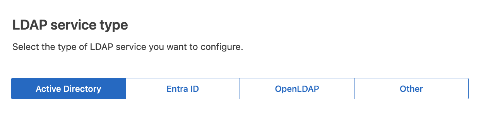

= Teste a conexão e salve a configuração
:allow-uri-read: 

. Selecione *Ativar federação de identidade*.
. Na secção tipo de serviço LDAP, selecione o tipo de serviço LDAP que pretende configurar.
+

+
Selecione *Other* para configurar valores para um servidor LDAP que use o Oracle Directory Server.

. Se você selecionou *Other*, preencha os campos na seção atributos LDAP. Caso contrário, vá para a próxima etapa.
+
** *Nome exclusivo do usuário*: O nome do atributo que contém o identificador exclusivo de um usuário LDAP. Este atributo é equivalente `sAMAccountName` ao ative Directory e `uid` ao OpenLDAP. Se estiver configurando o Oracle Directory Server, digite `uid`.
** *UUID de usuário*: O nome do atributo que contém o identificador exclusivo permanente de um usuário LDAP. Este atributo é equivalente `objectGUID` ao ative Directory e `entryUUID` ao OpenLDAP. Se estiver configurando o Oracle Directory Server, digite `nsuniqueid`. O valor de cada usuário para o atributo especificado deve ser um número hexadecimal de 32 dígitos no formato de 16 bytes ou string, onde os hífens são ignorados.
** *Group Unique Name*: O nome do atributo que contém o identificador exclusivo de um grupo LDAP. Este atributo é equivalente `sAMAccountName` ao ative Directory e `cn` ao OpenLDAP. Se estiver configurando o Oracle Directory Server, digite `cn`.
** *Group UUID*: O nome do atributo que contém o identificador exclusivo permanente de um grupo LDAP. Este atributo é equivalente `objectGUID` ao ative Directory e `entryUUID` ao OpenLDAP. Se estiver configurando o Oracle Directory Server, digite `nsuniqueid`. O valor de cada grupo para o atributo especificado deve ser um número hexadecimal de 32 dígitos no formato de 16 bytes ou string, onde os hífens são ignorados.

. Para todos os tipos de serviço LDAP, introduza as informações de ligação de rede e servidor LDAP necessárias na secção Configurar servidor LDAP.
+
** *Nome de host*: O nome de domínio totalmente qualificado (FQDN) ou endereço IP do servidor LDAP.
** *Port*: A porta usada para se conetar ao servidor LDAP.
+

NOTE: A porta padrão para STARTTLS é 389 e a porta padrão para LDAPS é 636. No entanto, você pode usar qualquer porta desde que seu firewall esteja configurado corretamente.

** *Nome de usuário*: O caminho completo do nome distinto (DN) para o usuário que se conetará ao servidor LDAP.
+
No ative Directory, você também pode especificar o Nome de logon de nível inferior ou o Nome principal do usuário.

+
O usuário especificado deve ter permissão para listar grupos e usuários e para acessar os seguintes atributos:

+
*** `sAMAccountName` ou `uid`
*** `objectGUID`, `entryUUID`, ou `nsuniqueid`
*** `cn`
*** `memberOf` ou `isMemberOf`
*** *Ative Directory*: `objectSid`, `primaryGroupID`, `userAccountControl`, E `userPrincipalName`
*** *Azure*: `accountEnabled` E. `userPrincipalName`

** *Senha*: A senha associada ao nome de usuário.
+

NOTE: Se você alterar a senha no futuro, você deve atualizá-la nesta página.

** *Group base DN*: O caminho completo do nome distinto (DN) para uma subárvore LDAP que você deseja pesquisar grupos. No exemplo do ative Directory (abaixo), todos os grupos cujo Nome distinto é relativo ao DN base (DC-StorageGRID,DC-com) podem ser usados como grupos federados.
+

NOTE: Os valores *Group unique name* devem ser exclusivos dentro do *Group base DN* a que pertencem.

** *DN da base do usuário*: O caminho completo do nome distinto (DN) de uma subárvore LDAP que você deseja pesquisar por usuários.
+

NOTE: Os valores *Nome exclusivo do usuário* devem ser exclusivos dentro do *DN da base de usuários* a que pertencem.

** *Bind username format* (opcional): O padrão de username padrão StorageGRID deve ser usado se o padrão não puder ser determinado automaticamente.
+
É recomendado fornecer *Bind username format* porque pode permitir que os usuários façam login se o StorageGRID não conseguir vincular-se à conta de serviço.

+
Introduza um destes padrões:

+
*** *Padrão UserPrincipalName (ative Directory e Azure)*: `[USERNAME]@_example_.com`
*** * Padrão de nome de logon de nível inferior (ative Directory e Azure)*: `_example_\[USERNAME]`
*** * Padrão de nome distinto *: `CN=[USERNAME],CN=Users,DC=_example_,DC=com`
+
Inclua *[USERNAME]* exatamente como escrito.

. Na seção Transport Layer Security (TLS), selecione uma configuração de segurança.
+
** *Use STARTTLS*: Use STARTTLS para proteger as comunicações com o servidor LDAP. Esta é a opção recomendada para ative Directory, OpenLDAP ou outro, mas esta opção não é suportada para o Azure.
** *Use LDAPS*: A opção LDAPS (LDAP sobre SSL) usa TLS para estabelecer uma conexão com o servidor LDAP. Você deve selecionar essa opção para o Azure.
** *Não use TLS*: O tráfego de rede entre o sistema StorageGRID e o servidor LDAP não será protegido. Esta opção não é suportada para o Azure.
+

NOTE: O uso da opção *não usar TLS* não é suportado se o servidor do ative Directory forçar a assinatura LDAP. Você deve usar STARTTLS ou LDAPS.

. Se você selecionou STARTTLS ou LDAPS, escolha o certificado usado para proteger a conexão.
+
** *Use o certificado CA do sistema operacional*: Use o certificado CA de grade padrão instalado no sistema operacional para proteger conexões.
** *Use certificado CA personalizado*: Use um certificado de segurança personalizado.
+
Se você selecionar essa configuração, copie e cole o certificado de segurança personalizado na caixa de texto certificado da CA.

=== Teste a conexão e salve a configuração

Depois de introduzir todos os valores, tem de testar a ligação antes de poder guardar a configuração. O StorageGRID verifica as configurações de conexão para o servidor LDAP e o formato de nome de usuário de vinculação, se você tiver fornecido uma.

.Passos
. Selecione *Test Connection*.
. Se você não forneceu um formato de nome de usuário do BIND:
+
** É apresentada uma mensagem "Test Connection successful" (testar ligação bem-sucedida) se as definições de ligação forem válidas. Selecione *Save* (Guardar) para guardar a configuração.
** É apresentada uma mensagem "não foi possível estabelecer ligação de teste" se as definições da ligação forem inválidas. Selecione *Fechar*. Em seguida, resolva quaisquer problemas e teste a conexão novamente.

. Se você tiver fornecido um formato de nome de usuário do BIND, insira o nome de usuário e a senha de um usuário federado válido.
+
Por exemplo, insira seu próprio nome de usuário e senha. Não inclua carateres especiais no nome de usuário, como em ou /.

+
image::../media/identity_federation_test_connection.png[Pedido de federação de identidade para validar o formato de nome de usuário do BIND]

+
** É apresentada uma mensagem "Test Connection successful" (testar ligação bem-sucedida) se as definições de ligação forem válidas. Selecione *Save* (Guardar) para guardar a configuração.
** Uma mensagem de erro é exibida se as configurações de conexão, o formato de nome de usuário de ligação ou o nome de usuário de teste e a senha forem inválidos. Resolva quaisquer problemas e teste a conexão novamente.

