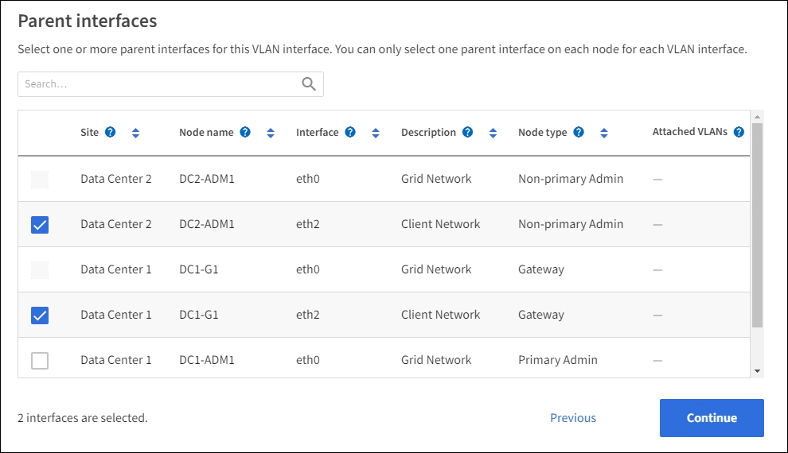

= Configurar interfaces VLAN
:allow-uri-read: 
:icons: font
:imagesdir: ../media/

[role="lead"]
Você pode criar interfaces de LAN virtual (VLAN) em nós de administração e nós de gateway e usá-las em grupos de HA e pontos de extremidade do balanceador de carga para isolar e particionar o tráfego para obter segurança, flexibilidade e desempenho.

== Considerações para interfaces VLAN

* Você cria uma interface VLAN inserindo um ID de VLAN e escolhendo uma interface pai em um ou mais nós.
* Uma interface pai deve ser configurada como uma interface de tronco no switch.
* Uma interface pai pode ser a rede de Grade (eth0), a rede de Cliente (eth2) ou uma interface de tronco adicional para a VM ou host bare-metal (por exemplo, ens256).
* Para cada interface VLAN, você pode selecionar apenas uma interface pai para um determinado nó. Por exemplo, você não pode usar a interface de rede de Grade e a interface de rede de cliente no mesmo nó de gateway que a interface pai para a mesma VLAN.
* Se a interface VLAN for para tráfego Admin Node, que inclui tráfego relacionado ao Grid Manager e ao Tenant Manager, selecione interfaces somente em Admin Nodes.
* Se a interface VLAN for para tráfego de cliente S3, selecione interfaces em nós de administração ou nós de gateway.
* Se você precisar adicionar interfaces de tronco, consulte o seguinte para obter detalhes:
+
** *VMware (após a instalação do nó)*: link:../maintain/vmware-adding-trunk-or-access-interfaces-to-node.html["VMware: Adicione interfaces de tronco ou acesso a um nó"]
** *Linux (antes de instalar o nó)*:link:../swnodes/creating-node-configuration-files.html["Criar arquivos de configuração de nó"]
** *Linux (após instalar o nó)*:link:../maintain/linux-adding-trunk-or-access-interfaces-to-node.html["Adicionar interfaces de tronco ou de acesso a um nó"]

NOTE: "Linux" refere-se a uma implantação RHEL, Ubuntu ou Debian.  Para obter uma lista de versões suportadas, consulte o https://imt.netapp.com/matrix/#welcome["Ferramenta de Matriz de interoperabilidade NetApp (IMT)"^] .

== Crie uma interface VLAN

.Antes de começar
* Você está conetado ao Gerenciador de Grade usando um link:../admin/web-browser-requirements.html["navegador da web suportado"].
* Você tem o link:admin-group-permissions.html["Permissão de acesso à raiz"].
* Uma interface de tronco foi configurada na rede e conetada ao nó VM ou Linux. Você sabe o nome da interface do tronco.
* Você sabe o ID da VLAN que está configurando.

.Sobre esta tarefa
O administrador da rede pode ter configurado uma ou mais interfaces de tronco e uma ou mais VLANs para segregar o tráfego de cliente ou administrador pertencente a diferentes aplicativos ou locatários. Cada VLAN é identificada por um ID numérico ou tag. Por exemplo, sua rede pode usar VLAN 100 para tráfego FabricPool e VLAN 200 para um aplicativo de arquivamento.

Você pode usar o Gerenciador de Grade para criar interfaces de VLAN que permitem que os clientes acessem o StorageGRID em uma VLAN específica. Ao criar interfaces VLAN, você especifica a ID da VLAN e seleciona interfaces pai (tronco) em um ou mais nós.

=== Acesse o assistente

.Passos
. Selecione *Configuração* > *Rede* > *Interfaces VLAN*.
. Selecione *criar*.

=== Insira os detalhes das interfaces VLAN

.Passos
. Especifique o ID da VLAN na rede. Pode introduzir qualquer valor entre 1 e 4094.
+
Os IDs de VLAN não precisam ser exclusivos. Por exemplo, você pode usar VLAN ID 200 para tráfego de administrador em um local e o mesmo VLAN ID para tráfego de cliente em outro local. Você pode criar interfaces VLAN separadas com diferentes conjuntos de interfaces pai em cada local. No entanto, duas interfaces VLAN com o mesmo ID não podem compartilhar a mesma interface em um nó. Se você especificar uma ID que já foi usada, uma mensagem será exibida.

. Opcionalmente, insira uma breve descrição para a interface VLAN.
. Selecione *continuar*.

=== Escolha interfaces pai

A tabela lista as interfaces disponíveis para todos os nós de administração e nós de gateway em cada local da grade. As interfaces Admin Network (eth1) não podem ser usadas como interfaces pai e não são mostradas.

.Passos
. Selecione uma ou mais interfaces pai às quais anexar esta VLAN.
+
Por exemplo, você pode querer anexar uma VLAN à interface de rede de cliente (eth2) para um nó de gateway e um nó de administrador.

+

. Selecione *continuar*.

=== Confirme as definições

.Passos
. Revise a configuração e faça quaisquer alterações.
+
** Se você precisar alterar a ID ou a descrição da VLAN, selecione *Digite os detalhes da VLAN* na parte superior da página.
** Se você precisar alterar uma interface pai, selecione *escolha interfaces pai* na parte superior da página ou selecione *anterior*.
** Se for necessário remover uma interface pai, selecione a lixeira image:../media/icon-trash-can.png["ícone da lata de lixo"].

. Selecione *Guardar*.
. Aguarde até 5 minutos para que a nova interface apareça como uma seleção na página Grupos de alta disponibilidade e seja listada na tabela *Interfaces de rede* do nó (*Nós* > *_nó de interface pai_* > *Rede*).

== Editar uma interface VLAN

Ao editar uma interface VLAN, você pode fazer os seguintes tipos de alterações:

* Altere a ID ou a descrição da VLAN.
* Adicionar ou remover interfaces pai.

Por exemplo, você pode querer remover uma interface pai de uma interface VLAN se você planeja desativar o nó associado.

Observe o seguinte:

* Não é possível alterar um ID de VLAN se a interface de VLAN for usada em um grupo HA.
* Não é possível remover uma interface pai se essa interface pai for usada em um grupo HA.
+
Por exemplo, suponha que a VLAN 200 esteja conetada às interfaces pai nos nós A e B. se um grupo de HA usar a interface VLAN 200 para o nó A e a interface eth2 para o nó B, você poderá remover a interface pai não utilizada para o nó B, mas não poderá remover a interface pai usada para o nó A.

.Passos
. Selecione *Configuração* > *Rede* > *Interfaces VLAN*.
. Marque a caixa de seleção para a interface VLAN que deseja editar. Em seguida, selecione *ações* > *Editar*.
. Opcionalmente, atualize o ID da VLAN ou a descrição. Em seguida, selecione *continuar*.
+
Não é possível atualizar um ID de VLAN se a VLAN for usada em um grupo HA.

. Opcionalmente, marque ou desmarque as caixas de seleção para adicionar interfaces pai ou remover interfaces não utilizadas. Em seguida, selecione *continuar*.
. Revise a configuração e faça quaisquer alterações.
. Selecione *Guardar*.

== Remova uma interface VLAN

Você pode remover uma ou mais interfaces VLAN.

Não é possível remover uma interface VLAN se ela for usada atualmente em um grupo HA. Você deve remover a interface VLAN do grupo HA antes de removê-la.

Para evitar quaisquer interrupções no tráfego do cliente, considere fazer um dos seguintes procedimentos:

* Adicione uma nova interface VLAN ao grupo HA antes de remover essa interface VLAN.
* Crie um novo grupo HA que não use essa interface VLAN.
* Se a interface VLAN que você deseja remover for atualmente a interface ativa, edite o grupo HA. Mova a interface VLAN que você deseja remover para a parte inferior da lista de prioridades. Aguarde até que a comunicação seja estabelecida na nova interface primária e remova a interface antiga do grupo HA. Finalmente, exclua a interface VLAN nesse nó.

.Passos
. Selecione *Configuração* > *Rede* > *Interfaces VLAN*.
. Marque a caixa de seleção para cada interface VLAN que você deseja remover. Em seguida, selecione *ações* > *Excluir*.
. Selecione *Sim* para confirmar a sua seleção.
+
Todas as interfaces VLAN selecionadas são removidas. Um banner verde de sucesso aparece na página interfaces VLAN.

