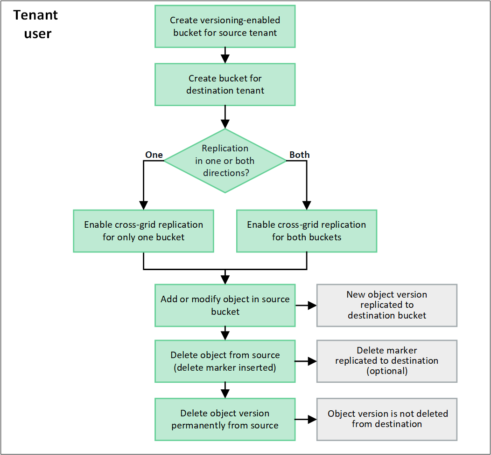

= O que é replicação entre redes?
:allow-uri-read: 
:icons: font
:imagesdir: ../media/

[role="lead"]
A replicação entre grade é a replicação automática de objetos entre buckets S3 selecionados em dois sistemas StorageGRID que estão conetados em um link:grid-federation-overview.html["conexão de federação de grade"]. link:grid-federation-what-is-account-clone.html["Clone de conta"] é necessário para replicação entre grades.

== Fluxo de trabalho para replicação entre grades

O diagrama de fluxo de trabalho resume as etapas para configurar a replicação entre grades entre buckets em duas grades.

== Requisitos para replicação entre grades

Se uma conta de locatário tiver a permissão *Usar conexão de federação de grade* para usar um ou maislink:grid-federation-overview.html["conexões de federação de grade"] , um usuário locatário com permissão de acesso Root pode criar buckets nas contas de locatário correspondentes em cada grade.  Esses baldes:

* Podem ter nomes diferentes uns dos outros
* Pode ter regiões diferentes
* Deve ter o controle de versão habilitado
* Deve estar vazio

Depois que ambos os buckets tiverem sido criados, a replicação entre grades pode ser configurada para um ou ambos os buckets.

.Saiba mais
link:../tenant/grid-federation-manage-cross-grid-replication.html["Gerenciar a replicação entre grades"]

== Como a replicação entre redes funciona

Você pode configurar a replicação entre grades para ocorrer em uma direção ou em ambas as direções.

=== Replicação em uma direção

Se você habilitar a replicação entre grades para um bucket em apenas uma grade, os objetos adicionados a esse bucket (o bucket de origem) serão replicados para o bucket correspondente na outra grade (o bucket de destino).  No entanto, os objetos adicionados ao bucket de destino não são replicados de volta para a origem.  Na figura, a replicação entre grades está habilitada para `my-bucket` da Grade 1 para a Grade 2, mas não está habilitado na outra direção.

image::../media/grid-federation-cross-grid-replication-one-direction.png[imagem mostrando a conexão de federação de grade em uma direção]

=== Replicação em ambas as direções

Se você habilitar a replicação entre grade para o mesmo bucket em ambas as grades, os objetos adicionados a qualquer bucket serão replicados para a outra grade. Na figura, a replicação em grade cruzada é ativada para `my-bucket` em ambas as direções.

image::../media/grid-federation-cross-grid-replication.png[imagem mostrando replicação em uma direção em comparação com a replicação em ambas as direções]

=== O que acontece quando os objetos são ingeridos?

Quando um cliente S3 adiciona um objeto a um bucket que tem replicação entre grades ativada, o seguinte acontece:

. O StorageGRID replica automaticamente o objeto do bucket de origem para o bucket de destino. O tempo para executar essa operação de replicação em segundo plano depende de vários fatores, incluindo o número de outras operações de replicação pendentes.
+
O cliente S3 pode verificar o status de replicação de um objeto emitindo uma solicitação GetObject ou HeadObject.  A resposta inclui um StorageGRID específico `x-ntap-sg-cgr-replication-status` cabeçalho de resposta, que tem um dos seguintes valores:

+
[cols="1a,2a"]
|===
| Grelha | Estado da replicação 

 a| 
Fonte
 a| 
** *COMPLETED*: A replicação foi bem-sucedida para todas as conexões de grade.
** *PENDENTE*: O objeto não foi replicado para pelo menos uma conexão de grade.
** *FALHA*: A replicação não está pendente para nenhuma conexão de rede e pelo menos uma falhou com uma falha permanente.  Um usuário deve resolver o erro.

 a| 
Destino
 a| 
* RÉPLICA*: O objeto foi replicado a partir da grade de origem.

|===
+

NOTE: O StorageGRID não oferece suporte a `x-amz-replication-status` cabeçalho.

. O StorageGRID usa as políticas de ILM ativas de cada grade para gerenciar os objetos, assim como qualquer outro objeto. Por exemplo, Objeto A na Grade 1 pode ser armazenado como duas cópias replicadas e retido para sempre, enquanto a cópia do Objeto A que foi replicado para a Grade 2 pode ser armazenada usando codificação de apagamento 2-1 e excluída após três anos.

=== O que acontece quando os objetos são excluídos?

Conforme descrito link:../primer/delete-data-flow.html["Eliminar fluxo de dados"]no , o StorageGRID pode excluir um objeto por qualquer um destes motivos:

* O cliente S3 emite uma solicitação de exclusão.
* Um usuário do Tenant Manager seleciona a link:../tenant/deleting-s3-bucket-objects.html["Excluir objetos no bucket"] opção para remover todos os objetos de um bucket.
* O bucket tem uma configuração de ciclo de vida, que expira.
* O último período de tempo na regra ILM para o objeto termina, e não há mais colocações especificadas.

Quando o StorageGRID exclui um objeto devido a uma operação Excluir objetos na operação de bucket, expiração do ciclo de vida do bucket ou expiração do posicionamento do ILM, o objeto replicado nunca é excluído da outra grade em uma conexão de federação de grade. No entanto, os marcadores de exclusão adicionados ao bucket de origem por exclusões do cliente S3 podem ser replicados opcionalmente para o bucket de destino.

Para entender o que acontece quando um cliente S3 exclui objetos de um bucket que tem replicação entre grade ativada, revise como os clientes S3 excluem objetos de buckets que têm o controle de versão ativado, da seguinte forma:

* Se um cliente S3 emitir uma solicitação de exclusão que inclua um ID de versão, essa versão do objeto será removida permanentemente. Nenhum marcador de eliminação é adicionado ao balde.
* Se um cliente S3 emitir uma solicitação de exclusão que não inclua um ID de versão, o StorageGRID não excluirá nenhuma versão de objeto.  Em vez disso, ele adiciona um marcador de exclusão ao bucket.  O marcador de exclusão faz com que o StorageGRID aja como se o objeto tivesse sido excluído:
+
** Uma solicitação GetObject sem um ID de versão falha com `404 No Object Found`
** Uma solicitação GetObject com um ID de versão válido é bem-sucedida e retorna a versão do objeto solicitada.

Quando um cliente S3 exclui um objeto de um bucket que tem replicação entre grade ativada, o StorageGRID determina se deve replicar a solicitação de exclusão para o destino, da seguinte forma:

* Se a solicitação de exclusão incluir um ID de versão, essa versão do objeto será removida permanentemente da grade de origem.  No entanto, o StorageGRID não replica solicitações de exclusão que incluem um ID de versão, portanto, a mesma versão do objeto não é excluída do destino.
* Se a solicitação de exclusão não incluir um ID de versão, o StorageGRID poderá, opcionalmente, replicar o marcador de exclusão, com base em como a replicação entre grades está configurada para o bucket:
+
** Se você optar por replicar marcadores de exclusão (padrão), um marcador de exclusão será adicionado ao intervalo de origem e replicado ao intervalo de destino. Na verdade, o objeto parece ser excluído em ambas as grades.
** Se você optar por não replicar os marcadores de exclusão, um marcador de exclusão será adicionado ao bucket de origem, mas não será replicado no bucket de destino.  Na verdade, objetos que são excluídos na grade de origem não são excluídos na grade de destino.

Na figura, *Replicar marcadores de exclusão* foi definido como *Sim* quandolink:../tenant/grid-federation-manage-cross-grid-replication.html["a replicação entre redes foi ativada"] .  Solicitações de exclusão para o bucket de origem que incluem um ID de versão não excluem objetos do bucket de destino.  Solicitações de exclusão para o bucket de origem que não incluem um ID de versão parecem excluir objetos no bucket de destino.

image::../media/grid-federation-cross-grid-replication-delete.png[imagem que mostra a eliminação do cliente replicado em ambas as grelhas]

NOTE: Se você quiser manter as exclusões de objetos sincronizadas entre grades, crie correspondentes link:../s3/create-s3-lifecycle-configuration.html["Configurações do ciclo de vida do S3"] para os buckets em ambas as grades.

=== Como os objetos criptografados são replicados

Quando você usa replicação entre grade para replicar objetos entre grades, é possível criptografar objetos individuais, usar criptografia de bucket padrão ou configurar criptografia em toda a grade. Você pode adicionar, modificar ou remover configurações padrão de intervalo ou criptografia em toda a grade antes ou depois de ativar a replicação entre grade para um bucket.

Para criptografar objetos individuais, você pode usar SSE (criptografia do lado do servidor com chaves gerenciadas pelo StorageGRID) ao adicionar os objetos ao bucket de origem. Use o `x-amz-server-side-encryption` cabeçalho da solicitação e `AES256` especifique . link:../s3/using-server-side-encryption.html["Use a criptografia do lado do servidor"]Consulte .

NOTE: O uso de SSE-C (criptografia do lado do servidor com chaves fornecidas pelo cliente) não é suportado para replicação entre redes.  A operação de ingestão falhará.

Para usar a criptografia padrão para um bucket, use uma solicitação PutBucketEncryption e defina o `SSEAlgorithm` parâmetro como `AES256`. A criptografia no nível do bucket aplica-se a quaisquer objetos ingeridos sem o `x-amz-server-side-encryption` cabeçalho da solicitação. link:../s3/operations-on-buckets.html["Operações em baldes"]Consulte .

Para usar criptografia no nível da grade, defina a opção *Stored Object Encryption* como *AES-256*. A criptografia no nível da grade se aplica a quaisquer objetos que não sejam criptografados no nível do bucket ou que sejam ingeridos sem o `x-amz-server-side-encryption` cabeçalho da solicitação. link:../admin/changing-network-options-object-encryption.html["Configure as opções de rede e objeto"]Consulte .

NOTE: O SSE não suporta AES-128.  Se a opção *Criptografia de objeto armazenado* estiver habilitada para a grade de origem usando a opção *AES-128*, o uso do algoritmo AES-128 não será propagado para o objeto replicado.  Em vez disso, o objeto replicado usa a configuração de criptografia padrão do bucket ou do nível de grade do destino, se disponível.

Ao determinar como criptografar objetos de origem, o StorageGRID aplica estas regras:

. Use o `x-amz-server-side-encryption` cabeçalho de ingestão, se presente.
. Se um cabeçalho de ingestão não estiver presente, use a configuração de criptografia padrão do bucket, se configurada.
. Se uma configuração de bucket não estiver configurada, use a configuração de criptografia em toda a grade, se configurada.
. Se uma configuração para toda a grade não estiver presente, não criptografe o objeto de origem.

Ao determinar como criptografar objetos replicados, o StorageGRID aplica essas regras nesta ordem:

. Use a mesma criptografia que o objeto de origem, a menos que esse objeto use criptografia AES-128.
. Se o objeto de origem não estiver criptografado ou usar AES-128, use a configuração de criptografia padrão do bucket de destino, se configurada.
. Se o bucket de destino não tiver uma configuração de criptografia, use a configuração de criptografia em toda a grade do destino, se configurada.
. Se uma configuração para toda a grade não estiver presente, não criptografe o objeto de destino.

=== Replicação entre grades com bloqueio de objeto S3

Você pode configurar a replicação entre grades entre buckets do StorageGRID com o S3 Object Lock habilitado nas seguintes circunstâncias.

[cols="1a,1a"]
|===
| Quando o bloqueio de objeto S3 no bucket de origem é... | E o bloqueio de objeto S3 no bucket de destino é... 

 a| 
Habilitado
 a| 
Habilitado

 a| 
Desabilitado
 a| 
Habilitado

|===
Quando o bloqueio de objeto S3 no bucket de origem está habilitado:

* Os objetos são bloqueados com configurações de retenção no destino nesta ordem:
+
.. Valores do cabeçalho de retenção do objeto de origem para:
+
`x-amz-object-lock-mode`

+
`x-amz-object-lock-retain-until-date`

.. Retenção padrão do bucket de origem, se definida.
.. Retenção padrão do bucket de destino, se definida.

+
A retenção padrão do bucket de destino não substitui as configurações de retenção replicadas do objeto de origem.

* Você pode definir o status de retenção legal para o objeto de destino usando `x-amz-object-lock-legal-hold` ao carregar o objeto.
* Ocorrerá um erro se o locatário ou bucket de destino não oferecer suporte às configurações de bloqueio de objeto S3 do objeto de origem. Consulte link:../admin/grid-federation-troubleshoot.html#cross-grid-replication-alerts-and-errors["Alertas e erros de replicação entre grades."]

Quando o bloqueio de objeto S3 no bucket de origem está desabilitado:

* Você pode configurar a retenção padrão no bucket de destino para aplicar as configurações de retenção do S3 Object Lock ao objeto de destino.
* O objeto de destino não pode definir um status de retenção legal.

=== PutObjectTagging e DeleteObjectTagging não são suportados

As solicitações PutObjectTagging e DeleteObjectTagging não são suportadas para objetos em buckets que têm replicação entre grade ativada.

Se um cliente S3 emitir uma solicitação PutObjectTagging ou DeleteObjectTagging, `501 Not Implemented` é retornado.  A mensagem é `Put(Delete) ObjectTagging isn't available for buckets that have cross-grid replication configured` .

=== PutObjectRetention e PutObjectLegalHold não são suportados

As solicitações PutObjectRetention e PutObjectLegalHold não são totalmente suportadas para objetos em buckets que têm replicação entre grades habilitada.

Se um cliente S3 emitir uma solicitação PutObjectRetention ou PutObjectLegalHold, as configurações do objeto de origem serão modificadas, mas as alterações não serão aplicadas ao destino.

=== Como os objetos segmentados são replicados

O tamanho máximo do segmento da grade de origem se aplica a objetos replicados na grade de destino.  Quando objetos são replicados para outra grade, a configuração *Tamanho Máximo do Segmento* (*Configuração* > *Sistema* > *Opções de armazenamento*) da grade de origem é usada em ambas as grades.  Por exemplo, suponha que o tamanho máximo do segmento para a grade de origem seja 1 GB, enquanto o tamanho máximo do segmento da grade de destino seja 50 MB.  Se você ingerir um objeto de 2 GB na grade de origem, esse objeto será salvo como dois segmentos de 1 GB.  Ele também é replicado para a grade de destino como dois segmentos de 1 GB, embora o tamanho máximo do segmento dessa grade seja 50 MB.
