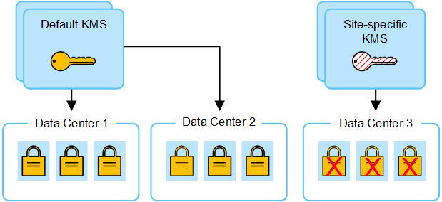

= Considerações para alterar o KMS para um site
:allow-uri-read: 
:icons: font
:imagesdir: ../media/

[role="lead"]
Cada servidor de gerenciamento de chaves (KMS) ou cluster KMS fornece uma chave de criptografia para todos os nós do dispositivo em um único local ou em um grupo de sites. Se você precisar alterar qual KMS é usado para um site, talvez seja necessário copiar a chave de criptografia de um KMS para outro.

Se você alterar o KMS usado para um site, você deve garantir que os nós de dispositivo criptografados anteriormente nesse local possam ser descriptografados usando a chave armazenada no novo KMS. Em alguns casos, talvez seja necessário copiar a versão atual da chave de criptografia do KMS original para o novo KMS. Você deve garantir que o KMS tenha a chave correta para descriptografar os nós de dispositivo criptografado no local.

Por exemplo:

. Você configura inicialmente um KMS padrão que se aplica a todos os sites que não têm um KMS dedicado.
. Quando o KMS é salvo, todos os nós de dispositivo que têm a configuração *Node Encryption* ativada conetam-se ao KMS e solicitam a chave de criptografia. Essa chave é usada para criptografar os nós do dispositivo em todos os locais. Esta mesma chave também deve ser usada para descriptografar esses aparelhos.
+
image::../media/kms_default_key.png[Chave padrão KMS]

. Você decide adicionar um KMS específico para um site (Data Center 3 na figura). No entanto, como os nós do appliance já estão criptografados, um erro de validação ocorre quando você tenta salvar a configuração para o KMS específico do site. O erro ocorre porque o KMS específico do site não tem a chave correta para descriptografar os nós nesse site.
+

. Para resolver o problema, copie a versão atual da chave de criptografia do KMS padrão para o novo KMS. (Tecnicamente, você copia a chave original para uma nova chave com o mesmo alias. A chave original torna-se uma versão anterior da nova chave.) O KMS específico do local agora tem a chave correta para descriptografar os nós do appliance no Data Center 3, para que ele possa ser salvo no StorageGRID.
+
image::../media/kms_copied_key.png[Chave copiada KMS]

== Casos de uso para alterar qual KMS é usado para um site

A tabela resume as etapas necessárias para os casos mais comuns para alterar o KMS de um site.

[cols="1a,2a"]
|===
| Caso de uso para alterar o KMS de um site | Passos necessários 

 a| 
Você tem uma ou mais entradas KMS específicas do site e deseja usar uma delas como KMS padrão.
 a| 
Edite o KMS específico do site. No campo *gerencia chaves para*, selecione *Sites não gerenciados por outro KMS (KMS padrão)*. O KMS específico do site agora será usado como o KMS padrão. Ele se aplicará a quaisquer sites que não tenham um KMS dedicado.

link:kms-editing.html["Editar um servidor de gerenciamento de chaves (KMS)"]

 a| 
Você tem um KMS padrão e adiciona um novo site em uma expansão. Você não quer usar o KMS padrão para o novo site.
 a| 
. Se os nós de appliance no novo site já tiverem sido criptografados pelo KMS padrão, use o software KMS para copiar a versão atual da chave de criptografia do KMS padrão para um novo KMS.
. Usando o Gerenciador de Grade, adicione o novo KMS e selecione o site.

link:kms-adding.html["Adicionar um servidor de gerenciamento de chaves (KMS)"]

 a| 
Você quer que o KMS para um site use um servidor diferente.
 a| 
. Se os nós do dispositivo no local já tiverem sido criptografados pelo KMS existente, use o software KMS para copiar a versão atual da chave de criptografia do KMS existente para o novo KMS.
. Usando o Gerenciador de Grade, edite a configuração KMS existente e insira o novo nome de host ou endereço IP.

link:kms-adding.html["Adicionar um servidor de gerenciamento de chaves (KMS)"]

|===