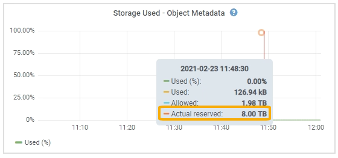

= Gerenciar o storage de metadados de objetos
:allow-uri-read: 
:icons: font
:imagesdir: ../media/

[role="lead"]
A capacidade de metadados de objetos de um sistema StorageGRID controla o número máximo de objetos que podem ser armazenados nesse sistema. Para garantir que seu sistema StorageGRID tenha espaço adequado para armazenar novos objetos, você deve entender onde e como o StorageGRID armazena os metadados de objetos.

== O que é metadados de objetos?

Metadados de objetos são qualquer informação que descreva um objeto. O StorageGRID usa metadados de objetos para rastrear os locais de todos os objetos na grade e gerenciar o ciclo de vida de cada objeto ao longo do tempo.

Para um objeto no StorageGRID, os metadados de objeto incluem os seguintes tipos de informações:

* Metadados do sistema, incluindo um ID exclusivo para cada objeto (UUID), o nome do objeto, o nome do bucket do S3, o nome ou ID da conta do locatário, o tamanho lógico do objeto, a data e hora em que o objeto foi criado pela primeira vez e a data e hora em que o objeto foi modificado pela última vez.
* Quaisquer pares de valor-chave de metadados de usuário personalizados associados ao objeto.
* Para objetos S3D, qualquer par de chave-valor de marca de objeto associado ao objeto.
* Para cópias de objetos replicadas, o local de storage atual de cada cópia.
* Para cópias de objetos com codificação de apagamento, o local de storage atual de cada fragmento.
* Para cópias de objetos em um Cloud Storage Pool, o local do objeto, incluindo o nome do bucket externo e o identificador exclusivo do objeto.
* Para objetos segmentados e objetos multipartes, identificadores de segmento e tamanhos de dados.

== Como os metadados de objetos são armazenados?

O StorageGRID mantém metadados de objetos em um banco de dados Cassandra, que é armazenado independentemente dos dados do objeto. Para fornecer redundância e proteger os metadados de objetos contra perda, o StorageGRID armazena três cópias dos metadados de todos os objetos no sistema em cada local.

Essa figura representa os nós de storage em dois locais. Cada local tem a mesma quantidade de metadados de objetos, e os metadados de cada local são subdivididos entre todos os nós de storage nesse local.

image::../media/metadata_space_across_sites.png[Espaço de metadados entre sites]

== Onde os metadados de objetos são armazenados?

Essa figura representa os volumes de storage de um único nó de storage.

image::../media/metadata_space_storage_node.png[Nó de armazenamento de espaço de metadados]

Como mostrado na figura, o StorageGRID reserva espaço para metadados de objetos no volume de storage 0 de cada nó de storage. Ele usa o espaço reservado para armazenar metadados de objetos e executar operações essenciais de banco de dados. Qualquer espaço restante no volume de storage 0 e todos os outros volumes de storage no nó de storage são usados exclusivamente para dados de objetos (cópias replicadas e fragmentos codificados por apagamento).

A quantidade de espaço reservada para metadados de objetos em um nó de storage específico depende de vários fatores, os quais são descritos abaixo.

== Definição de espaço reservado de metadados

O _Metadata reserved space_ é uma configuração em todo o sistema que representa a quantidade de espaço que será reservada para metadados no volume 0 de cada nó de armazenamento. Como mostrado na tabela, o valor padrão dessa configuração é baseado em:

* A versão de software que você estava usando quando você instalou o StorageGRID inicialmente.
* A quantidade de RAM em cada nó de armazenamento.

[cols="1a,1a,1a"]
|===
| Versão utilizada para a instalação inicial do StorageGRID | Quantidade de RAM nos nós de storage | Configuração de espaço reservado de metadados padrão 

 a| 
11,5 a 12,0
 a| 
128 GB ou mais em cada nó de storage na grade
 a| 
8 TB (8.000 GB)

 a| 
 a| 
Menos de 128 GB em qualquer nó de armazenamento na grade
 a| 
3 TB (3.000 GB)

 a| 
11,1 a 11,4
 a| 
128 GB ou mais em cada nó de armazenamento em qualquer local
 a| 
4 TB (4.000 GB)

 a| 
 a| 
Menos de 128 GB em qualquer nó de storage em cada local
 a| 
3 TB (3.000 GB)

 a| 
11,0 ou anterior
 a| 
Qualquer valor
 a| 
2 TB (2.000 GB)

|===

=== Exibir a configuração de espaço reservado de metadados

Siga estas etapas para visualizar a configuração espaço reservado metadados para o seu sistema StorageGRID.

.Passos
. Selecione *Configuração* > *Sistema* > *Configurações de armazenamento*.
. Na página Configurações de armazenamento, expanda a seção *espaço reservado de metadados*.

Para o StorageGRID 11,8 ou superior, o valor de espaço reservado de metadados deve ser de pelo menos 100 GB e não mais de 1 PB.

A configuração padrão para uma nova instalação do StorageGRID 11,6 ou superior na qual cada nó de armazenamento tem 128 GB ou mais de RAM é de 8.000 GB (8 TB).

== Espaço reservado real para metadados

Em contraste com a configuração espaço reservado de metadados em todo o sistema, o _espaço reservado real_ para metadados de objetos é determinado para cada nó de armazenamento. Para qualquer nó de armazenamento, o espaço reservado real para metadados depende do tamanho do volume 0 para o nó e da configuração de espaço reservado metadados em todo o sistema.

[cols="1a,1a"]
|===
| Tamanho do volume 0 para o nó | Espaço reservado real para metadados 

 a| 
Menos de 500 GB (uso não-produção)
 a| 
10% do volume 0

 a| 
500 GB ou mais ou mais nós de storage somente de metadados
 a| 
O menor desses valores:

* Volume 0
* Definição de espaço reservado de metadados

*Nota*: Somente um rangedb é necessário para nós de storage somente metadados.

|===

=== Veja o espaço reservado real para metadados

Siga estas etapas para exibir o espaço reservado real para metadados em um nó de armazenamento específico.

.Passos
. No Grid Manager, selecione *Nós* > *_Storage Node_*.
. Selecione a guia *armazenamento*.
. Posicione o cursor sobre o gráfico armazenamento usado - metadados de objetos e localize o valor *Real reservado*.
+

Na captura de tela, o valor *atual reservado* é de 8 TB. Esta captura de tela é para um nó de armazenamento grande em uma nova instalação do StorageGRID 11,6. Como a configuração espaço reservado de metadados em todo o sistema é menor que o volume 0 para este nó de armazenamento, o espaço reservado real para esse nó é igual à configuração espaço reservado de metadados.

=== Exemplo de espaço reservado real de metadados

Suponha que você instale um novo sistema StorageGRID usando a versão 11,7 ou posterior. Para este exemplo, suponha que cada nó de armazenamento tem mais de 128 GB de RAM e que o volume 0 do nó de armazenamento 1 (SN1) é de 6 TB. Com base nestes valores:

* O *espaço reservado de metadados* em todo o sistema está definido para 8 TB. (Este é o valor padrão para uma nova instalação do StorageGRID 11,6 ou superior se cada nó de armazenamento tiver mais de 128 GB de RAM.)
* O espaço reservado real para metadados para SN1 é de 6 TB. (Todo o volume é reservado porque o volume 0 é menor do que a configuração *espaço reservado de metadados*.)

== Espaço de metadados permitido

O espaço reservado real de cada nó de storage para metadados é subdividido no espaço disponível para metadados de objetos (o espaço de metadados permitido_) e no espaço necessário para operações essenciais de banco de dados (como compactação e reparo) e futuras atualizações de hardware e software. O espaço de metadados permitido rege a capacidade geral do objeto.

image::../media/metadata_allowed_space_volume_0.png[Metadados permitiram volume de espaço 0]

A tabela a seguir mostra como o StorageGRID calcula o espaço de metadados permitido* para diferentes nós de armazenamento, com base na quantidade de memória do nó e no espaço reservado real para metadados.

[cols="1a,1a,2a,2a"]
|===

 a| 
 a| 
 a| 
*Quantidade de memória no nó de armazenamento*

 a| 
 a| 
 a| 
&Lt; 128 GB
 a| 
&Gt; 128 GB

 a| 
*Espaço reservado real para metadados*
 a| 
&Lt; 4 TB
 a| 
60% do espaço reservado real para metadados, até um máximo de 1,32 TB
 a| 
60% do espaço reservado real para metadados, até um máximo de 1,98 TB

 a| 
&Gt; 4 TB
 a| 
(Espaço reservado real para metadados - 1 TB) x 60%, até um máximo de 1,32 TB
 a| 
(Espaço reservado real para metadados - 1 TB) x 60%, até um máximo de 3,96 TB

|===

=== Exibir espaço permitido de metadados

Siga estas etapas para exibir o espaço de metadados permitido para um nó de armazenamento.

.Passos
. No Grid Manager, selecione *Nós*.
. Selecione o nó de armazenamento.
. Selecione a guia *armazenamento*.
. Posicione o cursor sobre o gráfico armazenamento usado - metadados de objetos e localize o valor *permitido*.
+
image::../media/storage_used_object_metadata_allowed.png[Armazenamento usado - metadados Objeto - permitido]

Na captura de tela, o valor *permitido* é de 3,96 TB, que é o valor máximo para um nó de armazenamento cujo espaço reservado real para metadados é superior a 4 TB.

O valor *allowed* corresponde a esta métrica Prometheus:

`storagegrid_storage_utilization_metadata_allowed_bytes`

== Exemplo de espaço permitido de metadados

Suponha que você instale um sistema StorageGRID usando a versão 11,6. Para este exemplo, suponha que cada nó de armazenamento tem mais de 128 GB de RAM e que o volume 0 do nó de armazenamento 1 (SN1) é de 6 TB. Com base nestes valores:

* O *espaço reservado de metadados* em todo o sistema está definido para 8 TB. (Este é o valor padrão para o StorageGRID 11,6 ou superior quando cada nó de armazenamento tem mais de 128 GB de RAM.)
* O espaço reservado real para metadados para SN1 é de 6 TB. (Todo o volume é reservado porque o volume 0 é menor do que a configuração *espaço reservado de metadados*.)
* O espaço permitido para metadados no SN1 é de 3 TB, com base no cálculo mostrado no <<table-allowed-space-for-metadata,tabela para espaço permitido para metadados>>: (espaço reservado real para metadados - 1 TB) x 60%, até um máximo de 3,96 TB.

== Como os nós de storage de diferentes tamanhos afetam a capacidade do objeto

Como descrito acima, o StorageGRID distribui uniformemente os metadados de objetos nos nós de storage em cada local. Por esse motivo, se um site contiver nós de storage de tamanhos diferentes, o menor nó do local determinará a capacidade de metadados do local.

Considere o seguinte exemplo:

* Você tem uma grade de local único que contém três nós de storage de tamanhos diferentes.
* A configuração *espaço reservado de metadados* é de 4 TB.
* Os nós de storage têm os seguintes valores para o espaço de metadados reservado real e o espaço de metadados permitido.
+
[cols="1a,1a,1a,1a"]
|===
| Nó de storage | Tamanho do volume 0 | Espaço reservado real de metadados | Espaço de metadados permitido 

 a| 
SN1
 a| 
2,2 TB
 a| 
2,2 TB
 a| 
1,32 TB

 a| 
SN2
 a| 
5 TB
 a| 
4 TB
 a| 
1,98 TB

 a| 
SN3
 a| 
6 TB
 a| 
4 TB
 a| 
1,98 TB

|===

Como os metadados de objetos são distribuídos uniformemente pelos nós de storage em um local, cada nó neste exemplo pode conter apenas 1,32 TB de metadados. Os 0,66 TB adicionais de espaço permitido de metadados para SN2 e SN3 não podem ser usados.

image::../media/metadata_space_three_storage_nodes.png[Espaço de metadados três nós de storage]

Da mesma forma, como o StorageGRID mantém todos os metadados de objetos para um sistema StorageGRID em cada local, a capacidade geral de metadados de um sistema StorageGRID é determinada pela capacidade de metadados de objetos do menor local.

E como a capacidade de metadados de objetos controla a contagem máxima de objetos, quando um nó fica sem capacidade de metadados, a grade fica efetivamente cheia.

.Informações relacionadas
* Para saber como monitorar a capacidade de metadados de objetos para cada nó de armazenamento, consulte as instruções para link:../monitor/index.html["Monitorização do StorageGRID"].
* Para aumentar a capacidade dos metadados de objetos do seu sistema, link:../expand/index.html["expanda uma grade"]adicionando novos nós de storage.

