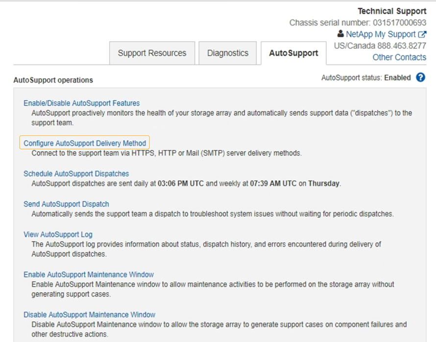

= Envie pacotes e-Series AutoSupport através do StorageGRID
:allow-uri-read: 
:icons: font
:imagesdir: ../media/

[role="lead"]
Você pode enviar pacotes do e-Series SANtricity System Manager AutoSupport para suporte técnico por meio de um nó de administração do StorageGRID, em vez da porta de gerenciamento do dispositivo de storage.

 https://docs.netapp.com/us-en/e-series-santricity/sm-support/autosupport-feature-overview.html["AutoSupport de hardware e-Series"^]Consulte para obter mais informações sobre como usar o AutoSupport com dispositivos e-Series.

.Antes de começar
* Você está conetado ao Gerenciador de Grade usando um link:../admin/web-browser-requirements.html["navegador da web suportado"].
* Você tem o link:admin-group-permissions.html["Administrador do dispositivo de storage ou permissão de acesso à raiz"].
* Você configurou o SANtricity AutoSupport:
+
** Para aparelhos SG6000 e SG5700, https://docs.netapp.com/us-en/storagegrid-appliances/installconfig/accessing-and-configuring-santricity-system-manager.html["Configure o AutoSupport no Gerenciador de sistemas do SANtricity"^]

NOTE: Você deve ter o firmware SANtricity 8,70 ou superior para acessar o Gerenciador de sistema do SANtricity usando o Gerenciador de Grade.

.Sobre esta tarefa
Os pacotes e-Series AutoSupport contêm detalhes do hardware de armazenamento e são mais específicos do que outros pacotes AutoSupport enviados pelo sistema StorageGRID.

Você pode configurar um endereço de servidor proxy especial no Gerenciador de sistema do SANtricity para transmitir pacotes do AutoSupport por meio de um nó de administração do StorageGRID sem o uso da porta de gerenciamento do dispositivo. Os pacotes AutoSupport transmitidos desta forma são enviados pelo link:../primer/what-admin-node-is.html["Nó Admin. Remetente preferido"], e usam qualquer um link:../admin/configuring-admin-proxy-settings.html["configurações de proxy de administrador"] que tenha sido configurado no Gerenciador de Grade.

NOTE: Este procedimento destina-se apenas à configuração de um servidor proxy StorageGRID para pacotes e-Series AutoSupport. Para obter detalhes adicionais sobre a configuração do e-Series AutoSupport, consulte https://docs.netapp.com/us-en/e-series-family/index.html["Documentação do NetApp e-Series e do SANtricity"^].

.Passos
. No Gerenciador de Grade, selecione *NÓS*.
. Na lista de nós à esquerda, selecione o nó do dispositivo de storage que deseja configurar.
. Selecione *Gerenciador do sistema SANtricity*.
+
É apresentada a página inicial do Gestor do sistema SANtricity.

+
image::../media/autosupport_santricity_home_page.png[Página inicial do AutoSupport SANtricity]

. Selecione *SUPPORT* > *SUPPORT Center* > *AutoSupport*.
+
É apresentada a página operations (operações de AutoSupport).

+

. Selecione *Configurar método de entrega AutoSupport*.
+
A página Configurar método de entrega AutoSupport é exibida.

+
image::../media/autosupport_configure_delivery_santricity.png[AutoSupport configure o método de entrega AutoSupport SANtricity]

. Selecione *HTTPS* para o método de entrega.
+

NOTE: O certificado que ativa o HTTPS está pré-instalado.

. Selecione *via servidor Proxy*.
. Introduza `tunnel-host` o *Endereço anfitrião*.
+
`tunnel-host` É o endereço especial para usar um nó de administrador para enviar pacotes e-Series AutoSupport.

. Introduza `10225` o *número da porta*.
+
`10225` É o número da porta no servidor proxy StorageGRID que recebe pacotes AutoSupport do controlador e-Series no dispositivo.

. Selecione *Configuração de teste* para testar o roteamento e a configuração do servidor proxy AutoSupport.
+
Se estiver correto, uma mensagem em um banner verde será exibida: "Sua configuração do AutoSupport foi verificada."

+
Se o teste falhar, uma mensagem de erro será exibida em um banner vermelho. Verifique as configurações de DNS e a rede do StorageGRID, verifique se o link:../primer/what-admin-node-is.html["Nó Admin. Remetente preferido"] pode se conetar ao site de suporte da NetApp e tente o teste novamente.

. Selecione *Guardar*.
+
A configuração é guardada e é apresentada uma mensagem de confirmação: "O método de entrega AutoSupport foi configurado."

