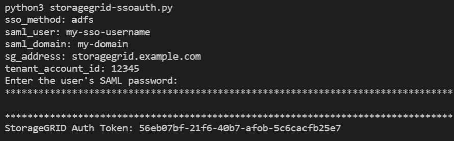

= Use a API se o logon único estiver ativado (ative Directory)
:allow-uri-read: 
:icons: font
:imagesdir: ../media/

[role="lead"]
Se você tiver link:../admin/configuring-sso.html["Logon único configurado e habilitado (SSO)"] e usar o ative Directory como provedor SSO, deverá emitir uma série de solicitações de API para obter um token de autenticação válido para a API de Gerenciamento de Grade ou para a API de Gerenciamento do locatário.

== Faça login na API se o logon único estiver ativado

Estas instruções se aplicam se você estiver usando o ative Directory como provedor de identidade SSO.

.Antes de começar
* Você conhece o nome de usuário e a senha SSO para um usuário federado que pertence a um grupo de usuários do StorageGRID.
* Se você quiser acessar a API de gerenciamento do locatário, você sabe o ID da conta do locatário.

.Sobre esta tarefa
Para obter um token de autenticação, você pode usar um dos seguintes exemplos:

* O `storagegrid-ssoauth.py` script Python, que está localizado no diretório de arquivos de instalação do StorageGRID (`./rpms`para Red Hat Enterprise Linux, `./debs` para Ubuntu ou Debian, e `./vsphere` para VMware).
* Um exemplo de fluxo de trabalho de solicitações curl.
+
O fluxo de trabalho curl pode ter um tempo limite se você o executar muito lentamente. Você pode ver o erro: `A valid SubjectConfirmation was not found on this Response`.

+

NOTE: O fluxo de trabalho cURL de exemplo não protege a senha de ser vista por outros usuários.

Se você tiver um problema de codificação de URL, poderá ver o erro: `Unsupported SAML version`.

.Passos
. Selecione um dos seguintes métodos para obter um token de autenticação:
+
** Use o `storagegrid-ssoauth.py` script Python. Avance para o passo 2.
** Use solicitações curl. Avance para o passo 3.

. Se você quiser usar o `storagegrid-ssoauth.py` script, passe o script para o interpretador Python e execute o script.
+
Quando solicitado, insira valores para os seguintes argumentos:

+
** O método SSO. Introduza ADFS ou adfs.
** O nome de usuário SSO
** O domínio onde o StorageGRID está instalado
** O endereço para StorageGRID
** O ID da conta do locatário, se você quiser acessar a API de gerenciamento do locatário.
+

+
O token de autorização StorageGRID é fornecido na saída. Agora você pode usar o token para outras solicitações, semelhante a como você usaria a API se o SSO não estivesse sendo usado.

. Se você quiser usar solicitações curl, use o procedimento a seguir.
+
.. Declare as variáveis necessárias para iniciar sessão.
+
[source, bash]
----
export SAMLUSER='my-sso-username'
export SAMLPASSWORD='my-password'
export SAMLDOMAIN='my-domain'
export TENANTACCOUNTID='12345'
export STORAGEGRID_ADDRESS='storagegrid.example.com'
export AD_FS_ADDRESS='adfs.example.com'
----
+

NOTE: Para acessar a API de gerenciamento de grade, use 0 como `TENANTACCOUNTID`.

.. Para receber um URL de autenticação assinada, emita uma SOLICITAÇÃO POST para `/api/v3/authorize-saml`, e remova a codificação JSON adicional da resposta.
+
Este exemplo mostra uma SOLICITAÇÃO POST para um URL de autenticação assinada para `TENANTACCOUNTID`. Os resultados serão passados para `python -m json.tool` remover a codificação JSON.

+
[source, bash]
----
curl -X POST "https://$STORAGEGRID_ADDRESS/api/v3/authorize-saml" \
  -H "accept: application/json" -H  "Content-Type: application/json" \
  --data "{\"accountId\": \"$TENANTACCOUNTID\"}" | python -m json.tool
----
+
A resposta para este exemplo inclui um URL assinado que é codificado por URL, mas não inclui a camada adicional de codificação JSON.

+
[listing]
----
{
    "apiVersion": "3.0",
    "data": "https://adfs.example.com/adfs/ls/?SAMLRequest=fZHLbsIwEEV%2FJTuv7...sSl%2BfQ33cvfwA%3D&RelayState=12345",
    "responseTime": "2018-11-06T16:30:23.355Z",
    "status": "success"
}
----
.. Salve o `SAMLRequest` da resposta para uso em comandos subsequentes.
+
[source, bash]
----
export SAMLREQUEST='fZHLbsIwEEV%2FJTuv7...sSl%2BfQ33cvfwA%3D'
----
.. Obtenha um URL completo que inclua o ID de solicitação do cliente do AD FS.
+
Uma opção é solicitar o formulário de login usando o URL da resposta anterior.

+
[source, bash]
----
curl "https://$AD_FS_ADDRESS/adfs/ls/?SAMLRequest=$SAMLREQUEST&RelayState=$TENANTACCOUNTID" | grep 'form method="post" id="loginForm"'
----
+
A resposta inclui o ID de solicitação do cliente:

+
[listing]
----
<form method="post" id="loginForm" autocomplete="off" novalidate="novalidate" onKeyPress="if (event && event.keyCode == 13) Login.submitLoginRequest();" action="/adfs/ls/?
SAMLRequest=fZHRToMwFIZfhb...UJikvo77sXPw%3D%3D&RelayState=12345&client-request-id=00000000-0000-0000-ee02-0080000000de" >
----
.. Salve o ID de solicitação do cliente da resposta.
+
[source, bash]
----
export SAMLREQUESTID='00000000-0000-0000-ee02-0080000000de'
----
.. Envie suas credenciais para a ação de formulário da resposta anterior.
+
[source, bash]
----
curl -X POST "https://$AD_FS_ADDRESS/adfs/ls/?SAMLRequest=$SAMLREQUEST&RelayState=$TENANTACCOUNTID&client-request-id=$SAMLREQUESTID" \
--data "UserName=$SAMLUSER@$SAMLDOMAIN&Password=$SAMLPASSWORD&AuthMethod=FormsAuthentication" --include
----
+
O AD FS retorna um redirecionamento 302, com informações adicionais nos cabeçalhos.

+

NOTE: Se a autenticação multifator (MFA) estiver ativada para seu sistema SSO, o post de formulário também conterá a segunda senha ou outras credenciais.

+
[listing]
----
HTTP/1.1 302 Found
Content-Length: 0
Content-Type: text/html; charset=utf-8
Location: https://adfs.example.com/adfs/ls/?SAMLRequest=fZHRToMwFIZfhb...UJikvo77sXPw%3D%3D&RelayState=12345&client-request-id=00000000-0000-0000-ee02-0080000000de
Set-Cookie: MSISAuth=AAEAADAvsHpXk6ApV...pmP0aEiNtJvWY=; path=/adfs; HttpOnly; Secure
Date: Tue, 06 Nov 2018 16:55:05 GMT
----
.. Salve o `MSISAuth` cookie da resposta.
+
[source, bash]
----
export MSISAuth='AAEAADAvsHpXk6ApV...pmP0aEiNtJvWY='
----
.. Envie uma SOLICITAÇÃO GET para o local especificado com os cookies do POST de autenticação.
+
[source, bash]
----
curl "https://$AD_FS_ADDRESS/adfs/ls/?SAMLRequest=$SAMLREQUEST&RelayState=$TENANTACCOUNTID&client-request-id=$SAMLREQUESTID" \
--cookie "MSISAuth=$MSISAuth" --include
----
+
Os cabeçalhos de resposta conterão informações de sessão do AD FS para uso posterior de logout e o corpo de resposta contém o SAMLResponse em um campo de formulário oculto.

+
[listing]
----
HTTP/1.1 200 OK
Cache-Control: no-cache,no-store
Pragma: no-cache
Content-Length: 5665
Content-Type: text/html; charset=utf-8
Expires: -1
Server: Microsoft-HTTPAPI/2.0
P3P: ADFS doesn't have P3P policy, please contact your site's admin for more details
Set-Cookie: SamlSession=a3dpbnRlcnMtUHJpbWFyeS1BZG1pbi0xNzgmRmFsc2Umcng4NnJDZmFKVXFxVWx3bkl1MnFuUSUzZCUzZCYmJiYmXzE3MjAyZTA5LThmMDgtNDRkZC04Yzg5LTQ3NDUxYzA3ZjkzYw==; path=/adfs; HttpOnly; Secure
Set-Cookie: MSISAuthenticated=MTEvNy8yMDE4IDQ6MzI6NTkgUE0=; path=/adfs; HttpOnly; Secure
Set-Cookie: MSISLoopDetectionCookie=MjAxOC0xMS0wNzoxNjozMjo1OVpcMQ==; path=/adfs; HttpOnly; Secure
Date: Wed, 07 Nov 2018 16:32:59 GMT

<form method="POST" name="hiddenform" action="https://storagegrid.example.com:443/api/saml-response">
  <input type="hidden" name="SAMLResponse" value="PHNhbWxwOlJlc3BvbnN...1scDpSZXNwb25zZT4=" /><input type="hidden" name="RelayState" value="12345" />
----
.. Salve o `SAMLResponse` do campo oculto:
+
[source, bash]
----
export SAMLResponse='PHNhbWxwOlJlc3BvbnN...1scDpSZXNwb25zZT4='
----
.. Usando o `SAMLResponse` , faça uma solicitação StorageGRID``/api/saml-response`` para gerar um token de autenticação StorageGRID.
+
Para `RelayState`, use o ID da conta do locatário ou use 0 se quiser entrar na API de gerenciamento de grade.

+
[source, bash]
----
curl -X POST "https://$STORAGEGRID_ADDRESS:443/api/saml-response" \
  -H "accept: application/json" \
  --data-urlencode "SAMLResponse=$SAMLResponse" \
  --data-urlencode "RelayState=$TENANTACCOUNTID" \
  | python -m json.tool
----
+
A resposta inclui o token de autenticação.

+
[listing]
----
{
    "apiVersion": "3.0",
    "data": "56eb07bf-21f6-40b7-af0b-5c6cacfb25e7",
    "responseTime": "2018-11-07T21:32:53.486Z",
    "status": "success"
}
----
.. Salve o token de autenticação na resposta como `MYTOKEN`.
+
[source, bash]
----
export MYTOKEN="56eb07bf-21f6-40b7-af0b-5c6cacfb25e7"
----
+
Agora você pode usar `MYTOKEN` para outras solicitações, semelhante a como você usaria a API se o SSO não estivesse sendo usado.

== Saia da API se o logon único estiver ativado

Se o logon único (SSO) tiver sido ativado, você deverá emitir uma série de solicitações de API para sair da API de gerenciamento de grade ou da API de gerenciamento de locatário. Estas instruções se aplicam se você estiver usando o ative Directory como provedor de identidade SSO

.Sobre esta tarefa
Se necessário, você pode sair da API do StorageGRID fazendo logout da página de logout única da sua organização. Ou, você pode acionar o logout único (SLO) do StorageGRID, que requer um token válido do portador do StorageGRID.

.Passos
. Para gerar uma solicitação de logout assinada, passe "cookie "sso" para a API SLO:
+
[source, bash]
----
curl -k -X DELETE "https://$STORAGEGRID_ADDRESS/api/v3/authorize" \
-H "accept: application/json" \
-H "Authorization: Bearer $MYTOKEN" \
--cookie "sso=true" \
| python -m json.tool
----
+
Um URL de logout é retornado:

+
[listing]
----
{
    "apiVersion": "3.0",
    "data": "https://adfs.example.com/adfs/ls/?SAMLRequest=fZDNboMwEIRfhZ...HcQ%3D%3D",
    "responseTime": "2018-11-20T22:20:30.839Z",
    "status": "success"
}
----
. Salve o URL de logout.
+
[source, bash]
----
export LOGOUT_REQUEST='https://adfs.example.com/adfs/ls/?SAMLRequest=fZDNboMwEIRfhZ...HcQ%3D%3D'
----
. Envie uma solicitação para o URL de logout para acionar o SLO e redirecionar de volta para o StorageGRID.
+
[source, bash]
----
curl --include "$LOGOUT_REQUEST"
----
+
A resposta 302 é devolvida. O local de redirecionamento não é aplicável ao logout somente API.

+
[listing]
----
HTTP/1.1 302 Found
Location: https://$STORAGEGRID_ADDRESS:443/api/saml-logout?SAMLResponse=fVLLasMwEPwVo7ss%...%23rsa-sha256
Set-Cookie: MSISSignoutProtocol=U2FtbA==; expires=Tue, 20 Nov 2018 22:35:03 GMT; path=/adfs; HttpOnly; Secure
----
. Exclua o token do portador do StorageGRID.
+
A exclusão do token portador do StorageGRID funciona da mesma forma que sem SSO. Se "cookie "sso" não for fornecido, o usuário será desconetado do StorageGRID sem afetar o estado SSO.

+
[source, bash]
----
curl -X DELETE "https://$STORAGEGRID_ADDRESS/api/v3/authorize" \
-H "accept: application/json" \
-H "Authorization: Bearer $MYTOKEN" \
--include
----
+
Uma `204 No Content` resposta indica que o usuário está desconetado agora.

+
[listing]
----
HTTP/1.1 204 No Content
----

