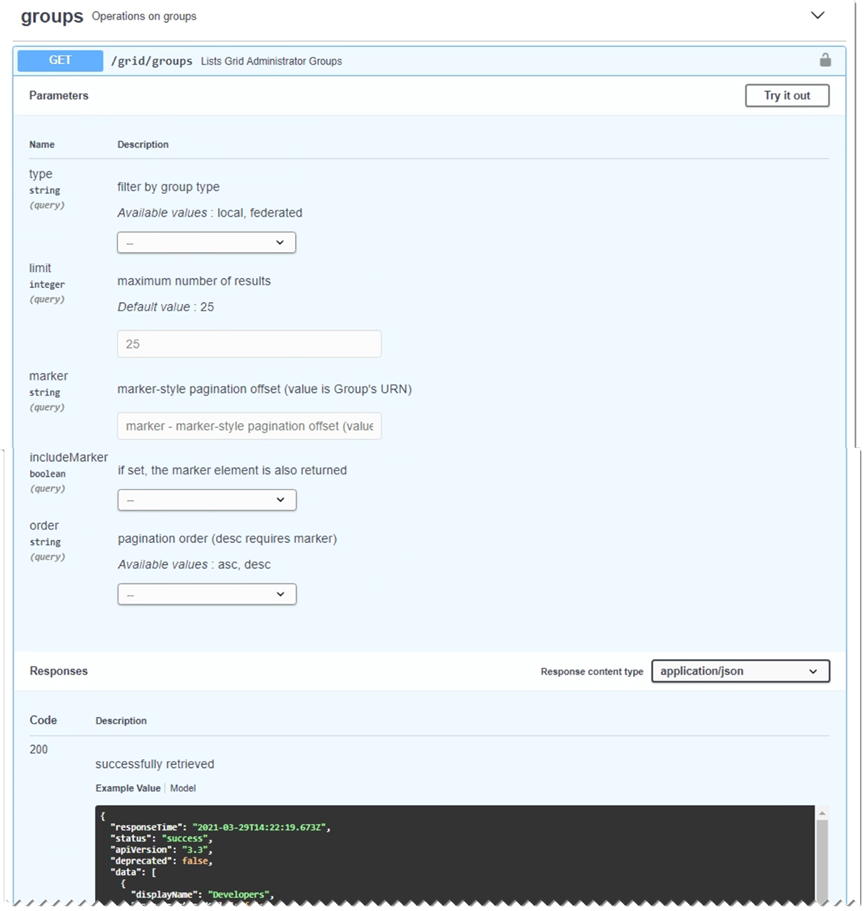

= Use a API de gerenciamento de grade
:allow-uri-read: 
:icons: font
:imagesdir: ../media/

[role="lead"]
Você pode executar tarefas de gerenciamento do sistema usando a API REST do Grid Management em vez da interface de usuário do Grid Manager. Por exemplo, você pode querer usar a API para automatizar operações ou criar várias entidades, como usuários, mais rapidamente.

== Recursos de nível superior

A API de gerenciamento de grade fornece os seguintes recursos de nível superior:

* `/grid`: O acesso é restrito aos usuários do Grid Manager e é baseado nas permissões de grupo configuradas.
* `/org`: O acesso é restrito a usuários que pertencem a um grupo LDAP local ou federado para uma conta de locatário. Para obter detalhes, link:../tenant/index.html["Use uma conta de locatário"]consulte .
* `/private`: O acesso é restrito aos usuários do Grid Manager e é baseado nas permissões de grupo configuradas. As APIs privadas estão sujeitas a alterações sem aviso prévio. Os endpoints privados do StorageGRID também ignoram a versão da API da solicitação.

== Emitir solicitações de API

A API de gerenciamento de grade usa a plataforma de API de código aberto Swagger. O Swagger fornece uma interface de usuário intuitiva que permite que desenvolvedores e não desenvolvedores realizem operações em tempo real no StorageGRID com a API.

A interface do usuário Swagger fornece detalhes completos e documentação para cada operação da API.

.Antes de começar
* Você está conetado ao Gerenciador de Grade usando um link:../admin/web-browser-requirements.html["navegador da web suportado"].
* Você link:admin-group-permissions.html["permissões de acesso específicas"]tem .

CAUTION: Todas as operações de API executadas usando a página da Documentação da API são operações ativas. Tenha cuidado para não criar, atualizar ou excluir dados de configuração ou outros dados por engano.

.Passos
. No cabeçalho do Gerenciador de Grade, selecione o ícone de ajuda e selecione *Documentação da API*.
+
image::../media/help_menu.png[Menu Ajuda]

. Para executar uma operação com a API privada, selecione *ir para a documentação da API privada* na página da API de gerenciamento do StorageGRID.
+
As APIs privadas estão sujeitas a alterações sem aviso prévio. Os endpoints privados do StorageGRID também ignoram a versão da API da solicitação.

. Selecione a operação desejada.
+
Ao expandir uma operação de API, você pode ver as ações HTTP disponíveis, como GET, PUT, UPDATE e DELETE.

. Selecione uma ação HTTP para ver os detalhes da solicitação, incluindo o URL do endpoint, uma lista de todos os parâmetros necessários ou opcionais, um exemplo do corpo da solicitação (quando necessário) e as possíveis respostas.
+

. Determine se a solicitação requer parâmetros adicionais, como um grupo ou ID de usuário. Em seguida, obtenha esses valores. Talvez você precise emitir uma solicitação de API diferente primeiro para obter as informações de que precisa.
. Determine se você precisa modificar o corpo de solicitação de exemplo. Em caso afirmativo, você pode selecionar *modelo* para aprender os requisitos para cada campo.
. Selecione *Experimente*.
. Forneça quaisquer parâmetros necessários ou modifique o corpo do pedido conforme necessário.
. Selecione *Executar*.
. Revise o código de resposta para determinar se a solicitação foi bem-sucedida.

