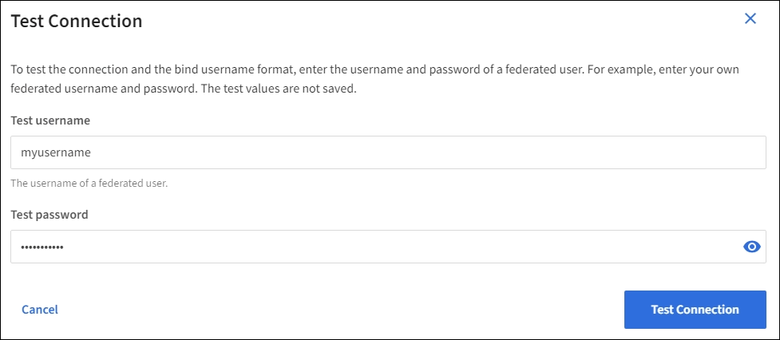

= Use a federação de identidade
:allow-uri-read: 
:icons: font
:imagesdir: ../media/

[role="lead"]
O uso da federação de identidade torna a configuração de grupos e usuários mais rápida e permite que os usuários façam login no StorageGRID usando credenciais familiares.

== Configure a federação de identidade para o Grid Manager

Você pode configurar a federação de identidade no Grid Manager se quiser que grupos de administradores e usuários sejam gerenciados em outro sistema, como Active Directory, Microsoft Entra ID, OpenLDAP ou Oracle Directory Server.

.Antes de começar
* Você está conectado ao Grid Manager usando umlink:../admin/web-browser-requirements.html["navegador da web suportado"] .
* Você temlink:admin-group-permissions.html["permissões de acesso específicas"] .
* Você está usando o Active Directory, o Microsoft Entra ID, o OpenLDAP ou o Oracle Directory Server como provedor de identidade.
+

NOTE: Se você quiser usar um serviço LDAP v3 que não esteja listado, entre em contato com o suporte técnico.

* Se você pretende usar o OpenLDAP, você deve configurar o servidor OpenLDAP. <<Diretrizes para configurar um servidor OpenLDAP>>Consulte .
* Se você planeja habilitar o logon único (SSO), você revisou olink:requirements-for-sso.html["requisitos e considerações para logon único"] .
* Se você planeja usar TLS (Transport Layer Security) para comunicações com o servidor LDAP, o provedor de identidade está usando TLS 1,2 ou 1,3. link:supported-ciphers-for-outgoing-tls-connections.html["Cifras suportadas para conexões TLS de saída"]Consulte .

.Sobre esta tarefa
Você pode configurar uma fonte de identidade para o Grid Manager se quiser importar grupos de outro sistema, como Active Directory, Microsoft Entra ID, OpenLDAP ou Oracle Directory Server.  Você pode importar os seguintes tipos de grupos:

* Grupos de administração. Os usuários nos grupos de administração podem entrar no Gerenciador de Grade e executar tarefas, com base nas permissões de gerenciamento atribuídas ao grupo.
* Grupos de usuários de locatários que não usam sua própria fonte de identidade. Os usuários em grupos de inquilinos podem entrar no Gerenciador de inquilinos e executar tarefas, com base nas permissões atribuídas ao grupo no Gerenciador de inquilinos. link:creating-tenant-account.html["Crie uma conta de locatário"]Consulte e link:../tenant/index.html["Use uma conta de locatário"] para obter detalhes.

=== Introduza a configuração

.Passos
. Selecione *Configuração* > *Controle de acesso* > *Federação de identidade*.
. Selecione *Ativar federação de identidade*.
. Na secção tipo de serviço LDAP, selecione o tipo de serviço LDAP que pretende configurar.
+
image::../media/ldap_service_type.png[Página de Federação de identidades que mostra as opções de tipo de serviço LDAP]

+
Selecione *Other* para configurar valores para um servidor LDAP que use o Oracle Directory Server.

. Se você selecionou *Other*, preencha os campos na seção atributos LDAP. Caso contrário, vá para a próxima etapa.
+
** *Nome exclusivo do usuário*: O nome do atributo que contém o identificador exclusivo de um usuário LDAP.  Este atributo é equivalente a `sAMAccountName` para o Active Directory e `uid` para OpenLDAP.  Se você estiver configurando o Oracle Directory Server, insira `uid` .
** *UUID do usuário*: O nome do atributo que contém o identificador exclusivo permanente de um usuário LDAP.  Este atributo é equivalente a `objectGUID` para o Active Directory e `entryUUID` para OpenLDAP.  Se você estiver configurando o Oracle Directory Server, insira `nsuniqueid` .  O valor de cada usuário para o atributo especificado deve ser um número hexadecimal de 32 dígitos em formato de 16 bytes ou string, onde hifens são ignorados.
** *Nome exclusivo do grupo*: O nome do atributo que contém o identificador exclusivo de um grupo LDAP.  Este atributo é equivalente a `sAMAccountName` para o Active Directory e `cn` para OpenLDAP.  Se você estiver configurando o Oracle Directory Server, insira `cn` .
** *UUID do grupo*: O nome do atributo que contém o identificador exclusivo permanente de um grupo LDAP.  Este atributo é equivalente a `objectGUID` para o Active Directory e `entryUUID` para OpenLDAP.  Se você estiver configurando o Oracle Directory Server, insira `nsuniqueid` .  O valor de cada grupo para o atributo especificado deve ser um número hexadecimal de 32 dígitos em formato de 16 bytes ou string, onde hifens são ignorados.

. Para todos os tipos de serviço LDAP, introduza as informações de ligação de rede e servidor LDAP necessárias na secção Configurar servidor LDAP.
+
** *Nome de host*: O nome de domínio totalmente qualificado (FQDN) ou endereço IP do servidor LDAP.
** *Port*: A porta usada para se conetar ao servidor LDAP.
+

NOTE: A porta padrão para STARTTLS é 389 e a porta padrão para LDAPS é 636. No entanto, você pode usar qualquer porta desde que seu firewall esteja configurado corretamente.

** *Nome de usuário*: O caminho completo do nome distinto (DN) para o usuário que se conetará ao servidor LDAP.
+
No ative Directory, você também pode especificar o Nome de logon de nível inferior ou o Nome principal do usuário.

+
O usuário especificado deve ter permissão para listar grupos e usuários e para acessar os seguintes atributos:

+
*** `sAMAccountName` ou `uid`
*** `objectGUID`, `entryUUID`, ou `nsuniqueid`
*** `cn`
*** `memberOf` ou `isMemberOf`
*** *Ative Directory*: `objectSid`, `primaryGroupID`, `userAccountControl`, E `userPrincipalName`
*** *ID de entrada*: `accountEnabled` e `userPrincipalName`

** *Senha*: A senha associada ao nome de usuário.
+

NOTE: Se você alterar a senha no futuro, você deve atualizá-la nesta página.

** *Group base DN*: O caminho completo do nome distinto (DN) para uma subárvore LDAP que você deseja pesquisar grupos. No exemplo do ative Directory (abaixo), todos os grupos cujo Nome distinto é relativo ao DN base (DC-StorageGRID,DC-com) podem ser usados como grupos federados.
+

NOTE: Os valores *Group unique name* devem ser exclusivos dentro do *Group base DN* a que pertencem.

** *DN da base do usuário*: O caminho completo do nome distinto (DN) de uma subárvore LDAP que você deseja pesquisar por usuários.
+

NOTE: Os valores *Nome exclusivo do usuário* devem ser exclusivos dentro do *DN da base de usuários* a que pertencem.

** *Bind username format* (opcional): O padrão de username padrão StorageGRID deve ser usado se o padrão não puder ser determinado automaticamente.
+
É recomendado fornecer *Bind username format* porque pode permitir que os usuários façam login se o StorageGRID não conseguir vincular-se à conta de serviço.

+
Introduza um destes padrões:

+
*** *Padrão UserPrincipalName (AD e Entra ID)*: `[USERNAME]@_example_.com`
*** *Padrão de nome de logon de nível inferior (ID do AD e Entra)*: `_example_\[USERNAME]`
*** * Padrão de nome distinto *: `CN=[USERNAME],CN=Users,DC=_example_,DC=com`
+
Inclua *[USERNAME]* exatamente como escrito.

. Na seção Transport Layer Security (TLS), selecione uma configuração de segurança.
+
** *Use STARTTLS*: Use STARTTLS para proteger as comunicações com o servidor LDAP.  Esta é a opção recomendada para Active Directory, OpenLDAP ou Outros, mas esta opção não é suportada para o Microsoft Entra ID.
** *Usar LDAPS*: A opção LDAPS (LDAP sobre SSL) usa TLS para estabelecer uma conexão com o servidor LDAP.  Você deve selecionar esta opção para o Microsoft Entra ID.
** *Não use TLS*: O tráfego de rede entre o sistema StorageGRID e o servidor LDAP não será protegido.  Esta opção não é suportada pelo Microsoft Entra ID.
+

NOTE: O uso da opção *Não usar TLS* não é suportado se o seu servidor Active Directory impõe assinatura LDAP.  Você deve usar STARTTLS ou LDAPS.

. Se você selecionou STARTTLS ou LDAPS, escolha o certificado usado para proteger a conexão.
+
** *Use o certificado CA do sistema operacional*: Use o certificado CA de grade padrão instalado no sistema operacional para proteger conexões.
** *Use certificado CA personalizado*: Use um certificado de segurança personalizado.
+
Se você selecionar essa configuração, copie e cole o certificado de segurança personalizado na caixa de texto certificado da CA.

=== Teste a conexão e salve a configuração

Depois de introduzir todos os valores, tem de testar a ligação antes de poder guardar a configuração. O StorageGRID verifica as configurações de conexão para o servidor LDAP e o formato de nome de usuário de vinculação, se você tiver fornecido uma.

.Passos
. Selecione *Test Connection*.
. Se você não forneceu um formato de nome de usuário de vinculação:
+
** É apresentada uma mensagem "Test Connection successful" (testar ligação bem-sucedida) se as definições de ligação forem válidas. Selecione *Save* (Guardar) para guardar a configuração.
** É apresentada uma mensagem "não foi possível estabelecer ligação de teste" se as definições da ligação forem inválidas. Selecione *Fechar*. Em seguida, resolva quaisquer problemas e teste a conexão novamente.

. Se você tiver fornecido um formato de nome de usuário do BIND, insira o nome de usuário e a senha de um usuário federado válido.
+
Por exemplo, insira seu próprio nome de usuário e senha. Não inclua carateres especiais no nome de usuário, como em ou /.

+

+
** É apresentada uma mensagem "Test Connection successful" (testar ligação bem-sucedida) se as definições de ligação forem válidas. Selecione *Save* (Guardar) para guardar a configuração.
** Uma mensagem de erro é exibida se as configurações de conexão, o formato de nome de usuário de ligação ou o nome de usuário de teste e a senha forem inválidos. Resolva quaisquer problemas e teste a conexão novamente.

== Forçar a sincronização com a fonte de identidade

O sistema StorageGRID sincroniza periodicamente grupos federados e usuários da origem da identidade. Você pode forçar o início da sincronização se quiser ativar ou restringir as permissões de usuário o mais rápido possível.

.Passos
. Vá para a página de federação de identidade.
. Selecione *servidor de sincronização* na parte superior da página.
+
O processo de sincronização pode demorar algum tempo, dependendo do ambiente.

+

NOTE: O alerta *Falha na sincronização da federação de identidade* é acionado se houver um problema na sincronização de grupos federados e usuários da origem da identidade.

== Desativar a federação de identidade

Você pode desabilitar temporária ou permanentemente a federação de identidade para grupos e usuários.  Quando a federação de identidade está desabilitada, não há comunicação entre o StorageGRID e a origem da identidade.  No entanto, todas as configurações que você definiu serão mantidas, permitindo que você reative facilmente a federação de identidades no futuro.

.Sobre esta tarefa
Antes de desativar a federação de identidade, você deve estar ciente do seguinte:

* Os utilizadores federados não poderão iniciar sessão.
* Os usuários federados que estiverem conetados no momento manterão o acesso ao sistema StorageGRID até que sua sessão expire, mas não poderão fazer login depois que sua sessão expirar.
* A sincronização entre o sistema StorageGRID e a fonte de identidade não ocorrerá, e alertas não serão gerados para contas que não foram sincronizadas.
* A caixa de seleção *Habilitar federação de identidade* será desabilitada se o status de logon único (SSO) for *Habilitado* ou *Modo Sandbox*.  O status do SSO na página de logon único deve ser *Desativado* antes que você possa desabilitar a federação de identidades. Ver link:../admin/disabling-single-sign-on.html["Desative o logon único"] .

.Passos
. Vá para a página de federação de identidade.
. Desmarque a caixa de seleção *Ativar federação de identidade*.

== Diretrizes para configurar um servidor OpenLDAP

Se você quiser usar um servidor OpenLDAP para federação de identidade, você deve configurar configurações específicas no servidor OpenLDAP.

CAUTION: Para fontes de identidade que não sejam o Active Directory ou o Microsoft Entra ID, o StorageGRID não bloqueará automaticamente o acesso ao S3 para usuários desabilitados externamente.  Para bloquear o acesso ao S3, exclua todas as chaves S3 do usuário ou remova o usuário de todos os grupos.

=== Sobreposições de Memberof e refint

As sobreposições membranadas e refinadas devem ser ativadas. Para obter mais informações, consulte as instruções para a manutenção da associação de grupo reverso no http://www.openldap.org/doc/admin24/index.html["Documentação do OpenLDAP: Guia do administrador da versão 2,4"^].

=== Indexação

Você deve configurar os seguintes atributos OpenLDAP com as palavras-chave de índice especificadas:

* `olcDbIndex: objectClass eq`
* `olcDbIndex: uid eq,pres,sub`
* `olcDbIndex: cn eq,pres,sub`
* `olcDbIndex: entryUUID eq`

Além disso, certifique-se de que os campos mencionados na ajuda do Nome de usuário sejam indexados para um desempenho ideal.

Consulte as informações sobre a manutenção da associação de grupo reverso no http://www.openldap.org/doc/admin24/index.html["Documentação do OpenLDAP: Guia do administrador da versão 2,4"^].
