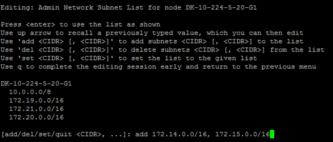
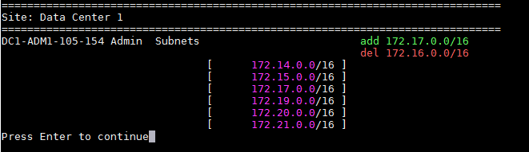

= Adicionar ou alterar listas de sub-rede na rede Admin
:allow-uri-read: 
:icons: font
:imagesdir: ../media/

[role="lead"]
Você pode adicionar, excluir ou alterar as sub-redes na Lista de sub-redes de rede Admin de um ou mais nós.

.Antes de começar
* Você tem o `Passwords.txt` arquivo.

Você pode adicionar, excluir ou alterar sub-redes para todos os nós na Lista de sub-redes de rede Admin.

[NOTE]
====
Não use sub-redes que contenham os seguintes endereços IPv4 para a Rede de Grade, Rede de Administração ou Rede de Cliente de qualquer nó:

* 192.168.130.101
* 192.168.131.101
* 192.168.130.102
* 192.168.131.102
* 198.51.100.2
* 198.51.100.4

Por exemplo, não use os seguintes intervalos de sub-rede para a Rede de grade, Rede de administração ou Rede de cliente de nenhum nó:

* 192.168.130.0/24 porque este intervalo de sub-rede contém os endereços IP 192.168.130.101 e 192.168.130.102
* 192.168.131.0/24 porque este intervalo de sub-rede contém os endereços IP 192.168.131.101 e 192.168.131.102
* 198.51.100.0/24 porque este intervalo de sub-rede contém os endereços IP 198.51.100.2 e 198.51.100.4

====
.Passos
. Faça login no nó de administração principal:
+
.. Introduza o seguinte comando: `ssh admin@_primary_Admin_Node_IP_`
.. Introduza a palavra-passe listada no `Passwords.txt` ficheiro.
.. Digite o seguinte comando para mudar para root: `su -`
.. Introduza a palavra-passe listada no `Passwords.txt` ficheiro.

+
Quando você estiver conetado como root, o prompt mudará de `$` para `#`.

. Inicie a ferramenta Change IP inserindo o seguinte comando: `change-ip`
. Insira a senha de provisionamento no prompt.
+
É apresentado o menu principal.

+
image::../media/change_ip_tool_main_menu.png[Captura de tela mostrando a tela de boas-vindas da ferramenta Change IP]

. Opcionalmente, limite as redes/nós nos quais as operações são executadas. Escolha uma das seguintes opções:
+
** Selecione os nós a editar escolhendo *1*, se você quiser filtrar em nós específicos nos quais executar a operação. Selecione uma das seguintes opções:
+
*** *1*: Nó único (selecionar pelo nome)
*** *2*: Nó único (selecione por site, depois pelo nome)
*** *3*: Nó único (selecionar por IP atual)
*** *4*: Todos os nós em um local
*** *5*: Todos os nós na grade
*** *0*: Volte

** Permitir que "All" (todos) permaneça selecionado. Após a seleção ser feita, é apresentado o ecrã do menu principal. O campo nós selecionados reflete sua nova seleção e agora todas as operações selecionadas serão executadas somente neste item.

. No menu principal, selecione a opção para editar sub-redes para a rede Admin (opção *3*).
. Escolha uma das seguintes opções:
+
--
** Adicione uma sub-rede inserindo este comando: `add CIDR`
** Exclua uma sub-rede inserindo este comando: `del CIDR`
** Defina a lista de sub-redes inserindo este comando: `set CIDR`

--
+
--

NOTE: Para todos os comandos, você pode inserir vários endereços usando este formato: `add CIDR, CIDR`

Exemplo: `add 172.14.0.0/16, 172.15.0.0/16, 172.16.0.0/16`

TIP: Você pode reduzir a quantidade de digitação necessária usando "seta para cima" para recuperar valores digitados anteriormente para o prompt de entrada atual e, em seguida, editá-los, se necessário.

A entrada de exemplo abaixo mostra a adição de sub-redes à Lista de sub-redes de Admin Network:

--
. Quando estiver pronto, digite *q* para voltar à tela do menu principal. Suas alterações são mantidas até serem limpas ou aplicadas.
+

NOTE: Se você selecionou qualquer um dos modos de seleção de nó "todos" na etapa 2, pressione *Enter* (sem *q*) para chegar ao próximo nó na lista.

. Escolha uma das seguintes opções:
+
** Selecione a opção *5* para mostrar as edições na saída que estão isoladas para mostrar apenas o item alterado. As alterações são realçadas em verde (adições) ou vermelho (exclusões), como mostrado na saída de exemplo abaixo:
+

** Selecione a opção *6* para mostrar as edições na saída que exibem a configuração completa. As alterações são realçadas em verde (adições) ou vermelho (exclusões). *Nota:* alguns emuladores de terminal podem mostrar adições e exclusões usando a formatação strikethrough.
+
Quando você tenta alterar a lista de sub-redes, a seguinte mensagem é exibida:

+
[listing]
----
CAUTION: The Admin Network subnet list on the node might contain /32 subnets derived from automatically applied routes that aren't persistent. Host routes (/32 subnets) are applied automatically if the IP addresses provided for external services such as NTP or DNS aren't reachable using default StorageGRID routing, but are reachable using a different interface and gateway. Making and applying changes to the subnet list will make all automatically applied subnets persistent. If you don't want that to happen, delete the unwanted subnets before applying changes. If you know that all /32 subnets in the list were added intentionally, you can ignore this caution.
----
+
Se você não atribuiu especificamente as sub-redes de servidor NTP e DNS a uma rede, o StorageGRID cria uma rota de host (/32) para a conexão automaticamente. Se, por exemplo, você preferir ter uma rota /16 ou /24 para conexão de saída a um servidor DNS ou NTP, você deve excluir a rota /32 criada automaticamente e adicionar as rotas que deseja. Se você não excluir a rota de host criada automaticamente, ela será persistida depois de aplicar quaisquer alterações à lista de sub-redes.

+

NOTE: Embora você possa usar essas rotas de host descobertas automaticamente, em geral, você deve configurar manualmente as rotas DNS e NTP para garantir a conetividade.

. Selecione a opção *7* para validar todas as alterações faseadas.
+
Essa validação garante que as regras para redes Grid, Admin e Client sejam seguidas, como o uso de sub-redes sobrepostas.

. Opcionalmente, selecione a opção *8* para guardar todas as alterações faseadas e voltar mais tarde para continuar a efetuar alterações.
+
Essa opção permite que você saia da ferramenta Change IP e inicie-a novamente mais tarde, sem perder nenhuma alteração não aplicada.

. Execute um dos seguintes procedimentos:
+
** Selecione a opção *9* se quiser limpar todas as alterações sem salvar ou aplicar a nova configuração de rede.
** Selecione a opção *10* se estiver pronto para aplicar alterações e provisionar a nova configuração de rede. Durante o provisionamento, a saída exibe o status à medida que as atualizações são aplicadas conforme mostrado na saída de exemplo a seguir:
+
[listing]
----
Generating new grid networking description file...

Running provisioning...

Updating grid network configuration on Name
----

. Faça o download de um novo Pacote de recuperação do Gerenciador de Grade.
+
.. Selecione *MAINTENANCE* > *System* > *Recovery package*.
.. Introduza a frase-passe de aprovisionamento.

