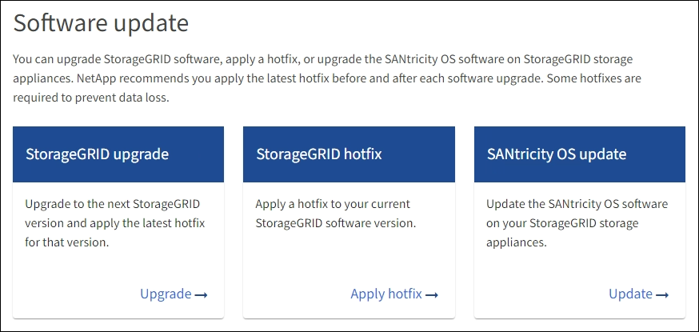

= Aplicar hotfix
:allow-uri-read: 
:icons: font
:imagesdir: ../media/

[role="lead"]
A correção é aplicada automaticamente primeiro ao nó de administração principal. Em seguida, você deve aprovar o aplicativo do hotfix para outros nós de grade até que todos os nós estejam executando a mesma versão de software. Você pode personalizar a sequência de aprovação selecionando para aprovar nós de grade individuais, grupos de nós de grade ou todos os nós de grade.

.Antes de começar
* Você revisou o link:storagegrid-hotfix-procedure.html["considerações para aplicar um hotfix"].
* Você tem a senha de provisionamento.
* Você tem acesso root ou a permissão Manutenção.

.Sobre esta tarefa
* Pode atrasar a aplicação de uma correção a um nó, mas o processo de correção não está concluído até aplicar a correção a todos os nós.
* Não é possível executar uma atualização do software StorageGRID ou uma atualização do SANtricity os até que o processo de correção seja concluído.

.Passos
. Faça login no Gerenciador de Grade usando um link:../admin/web-browser-requirements.html["navegador da web suportado"].
. Selecione *MAINTENANCE* > *System* > *Software update*.
+
A página Atualização de software é exibida.

+

. Selecione *aplicar hotfix*.
+
A página de correção do StorageGRID é exibida.

+
image::../media/hotfix_choose_file.png[Escolha Arquivo]

. Selecione o arquivo de hotfix que você baixou no site de suporte da NetApp.
+
.. Selecione *Procurar*.
.. Localize e selecione o ficheiro.
+
`hotfix-install-_version_`

.. Selecione *Open*.
+
O ficheiro é carregado. Quando o upload estiver concluído, o nome do arquivo é mostrado no campo Detalhes.

+

NOTE: Não altere o nome do arquivo porque ele faz parte do processo de verificação.

. Insira a senha de provisionamento na caixa de texto.
+
O botão *Start* (Iniciar) fica ativado.

. Selecione *Iniciar*.
+
É apresentado um aviso informando que a ligação do seu browser pode ser perdida temporariamente à medida que os serviços no nó de administração principal são reiniciados.

. Selecione *OK* para começar a aplicar o hotfix ao nó de administração principal.
+
Quando o hotfix é iniciado:

+
.. As validações de hotfix são executadas.
+

NOTE: Se algum erro for relatado, resolva-os, faça o upload novamente do arquivo de hotfix e selecione *Iniciar* novamente.

.. A tabela de progresso da instalação do hotfix é exibida.
+
Esta tabela mostra todos os nós na grade e o estágio atual da instalação do hotfix para cada nó. Os nós da tabela são agrupados por tipo (nós de administrador, nós de gateway e nós de storage).

.. A barra de progresso atinge a conclusão e, em seguida, o nó de administração principal é mostrado como "completo".
+
image::../media/hotfix_progress_table.png[Tabela de progresso do hotfix]

. Opcionalmente, classifique as listas de nós em cada agrupamento em ordem crescente ou decrescente por *Site*, *Nome*, *progresso*, *Estágio* ou *Detalhes*. Ou insira um termo na caixa *pesquisar* para pesquisar nós específicos.
. Aprove os nós de grade que estão prontos para ser atualizados. Nós aprovados do mesmo tipo são atualizados um de cada vez.
+

CAUTION: Não aprove o hotfix para um nó, a menos que você tenha certeza de que o nó está pronto para ser atualizado. Quando o hotfix é aplicado a um nó de grade, alguns serviços nesse nó podem ser reiniciados. Essas operações podem causar interrupções de serviço para clientes que estão se comunicando com o nó.

+
** Selecione um ou mais botões *Approve* para adicionar um ou mais nós individuais à fila de correções.
** Selecione o botão *Approve All* em cada agrupamento para adicionar todos os nós do mesmo tipo à fila de correções. Se você inseriu critérios de pesquisa na caixa *pesquisar*, o botão *aprovar tudo* se aplica a todos os nós selecionados pelos critérios de pesquisa.
+

NOTE: O botão *Approve All* na parte superior da página aprova todos os nós listados na página, enquanto o botão *Approve All* na parte superior de um agrupamento de tabelas só aprova todos os nós nesse grupo. Se a ordem em que os nós são atualizados for importante, aprove nós ou grupos de nós um de cada vez e aguarde até que a atualização seja concluída em cada nó antes de aprovar o(s) próximo(s) nó(s).

** Selecione o botão de nível superior *Approve All* na parte superior da página para adicionar todos os nós na grade à fila de hotfix.
+

NOTE: Tem de concluir a correção do StorageGRID antes de poder iniciar uma atualização de software diferente. Se não conseguir concluir a correção, contacte o suporte técnico.

** Selecione *Remover* ou *Remover tudo* para remover um nó ou todos os nós da fila de correções.
+
Quando o Estágio progride além de "enfileirado", o botão *Remover* fica oculto e você não pode mais remover o nó do processo de hotfix.

+
image::../media/approve_all_progresstable.png[Progresso do hotfix com o botão remover]

. Aguarde enquanto o hotfix é aplicado a cada nó de grade aprovado.
+
Quando o hotfix tiver sido instalado com sucesso em todos os nós, a tabela de progresso da instalação do Hotfix será fechada. Um banner verde mostra a data e a hora em que o hotfix foi concluído.

. Se o hotfix não puder ser aplicado a nenhum nó, revise o erro de cada nó, resolva o problema e repita essas etapas.
+
O procedimento não está concluído até que o hotfix seja aplicado com êxito a todos os nós. Você pode tentar novamente o processo de hotfix com segurança quantas vezes for necessário até que ele seja concluído.

