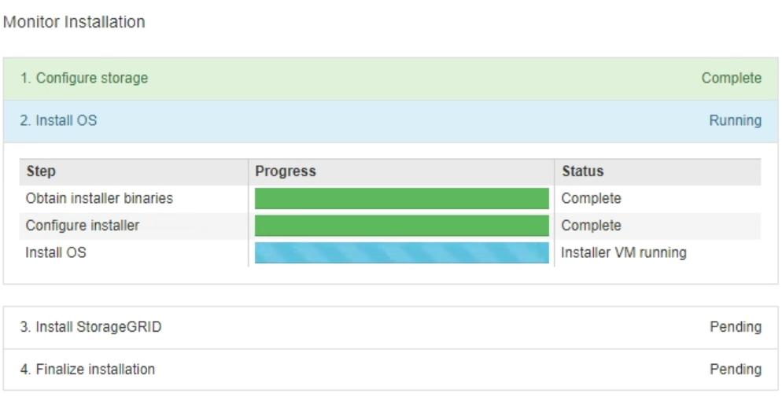

= Monitorar a instalação do dispositivo de serviços
:allow-uri-read: 
:icons: font
:imagesdir: ../media/

[role="lead"]
O Instalador de dispositivos StorageGRID fornece o status até que a instalação esteja concluída. Quando a instalação do software estiver concluída, o dispositivo é reinicializado.

.Passos
. Para monitorar o progresso da instalação, clique em *Monitor Installation* na barra de menus.
+
A página Instalação do monitor mostra o progresso da instalação.

+

+
A barra de status azul indica qual tarefa está atualmente em andamento. As barras de estado verdes indicam tarefas concluídas com êxito.

+

NOTE: O instalador garante que as tarefas concluídas em uma instalação anterior não sejam executadas novamente. Se você estiver reexecutando uma instalação, todas as tarefas que não precisam ser executadas novamente são mostradas com uma barra de status verde e um status de "ignorado".

. Reveja o progresso das duas primeiras fases de instalação.
+
** *1. Configurar armazenamento*
+
Durante este estágio, o instalador limpa qualquer configuração existente das unidades e configura as configurações do host.

** *2. Instale o os*
+
Durante esta fase, o instalador copia a imagem base do sistema operativo para o StorageGRID do nó de administração principal para o dispositivo ou instala o sistema operativo base a partir do pacote de instalação do nó de administração principal.

. Continue a monitorizar o progresso da instalação até que ocorra uma das seguintes situações:
+
** Para nós de Gateway de dispositivo ou nós de administração de dispositivo não-primário, o estágio *Install StorageGRID* é pausado e uma mensagem é exibida no console incorporado, solicitando que você aprove esse nó no nó de administrador usando o Gerenciador de grade.
+
image::../media/monitor_installation_install_sgws.gif[A imagem é descrita pelo texto circundante]

** Para os nós de administração principais do dispositivo, uma quinta fase (Load StorageGRID Installer) é exibida. Se a quinta fase estiver em andamento por mais de 10 minutos, atualize a página manualmente.
+
image::../media/monitor_reinstallation_primary_admin.png[Captura de tela da fase 5th para a reinstalação do nó de administração principal]

. Vá para a próxima etapa do processo de recuperação para o tipo de nó de grade de dispositivo que você está recuperando.
+
[cols="1a,2a"]
|===
| Tipo de recuperação | Referência 

 a| 
Nó de gateway
 a| 
link:selecting-start-recovery-to-configure-gateway-node.html["Selecione Iniciar recuperação para configurar o Gateway Node"]

 a| 
Nó de administração não primário
 a| 
link:selecting-start-recovery-to-configure-non-primary-admin-node.html["Selecione Iniciar recuperação para configurar o nó de administração não primário"]

 a| 
Nó de administração principal
 a| 
link:configuring-replacement-primary-admin-node.html["Configure o nó de administração principal de substituição"]

|===

