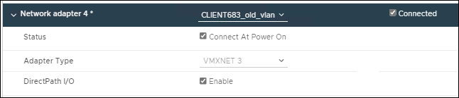

= VMware: Adicione interfaces de tronco ou acesso a um nó
:allow-uri-read: 
:icons: font
:imagesdir: ../media/

[role="lead"]
Você pode adicionar um tronco ou uma interface de acesso a um nó da VM depois que o nó tiver sido instalado. As interfaces adicionadas são exibidas na página interfaces VLAN e na página grupos HA.

.Antes de começar
* Tem acesso às instruções para link:../vmware/index.html["Instalando o StorageGRID em sua plataforma VMware"].
* Você tem máquinas virtuais Admin Node e Gateway Node VMware.
* Você tem uma sub-rede de rede que não está sendo usada como rede de Grade, Admin ou rede de Cliente.
* Você tem o `Passwords.txt` arquivo.
* Você link:../admin/admin-group-permissions.html["permissões de acesso específicas"]tem .

CAUTION: Não tente adicionar interfaces a um nó enquanto uma atualização de software, procedimento de recuperação ou procedimento de expansão estiver ativo.

.Sobre esta tarefa
Siga estas etapas para adicionar uma ou mais interfaces extras a um nó VMware depois que o nó tiver sido instalado. Por exemplo, você pode querer adicionar uma interface de tronco a um Admin ou Gateway Node, para que você possa usar interfaces VLAN para segregar o tráfego que pertence a diferentes aplicativos ou locatários. Ou você pode querer adicionar uma interface de acesso para usar em um grupo de alta disponibilidade (HA).

Se você adicionar uma interface de tronco, deverá configurar uma interface de VLAN no StorageGRID. Se você adicionar uma interface de acesso, poderá adicionar a interface diretamente a um grupo HA; não será necessário configurar uma interface VLAN.

O nó pode estar indisponível por um breve período de tempo quando você adiciona interfaces.

.Passos
. No vCenter, adicione um novo adaptador de rede (tipo VMXNET3) a uma VM Admin Node e Gateway Node. Selecione as caixas de verificação *Connected* e *Connect at Power On*.
+

. Use SSH para fazer login no Admin Node ou Gateway Node.
. Utilize `ip link show` para confirmar que foi detetada a nova interface de rede ens256.
+
[listing]
----
ip link show
1: lo: <LOOPBACK,UP,LOWER_UP> mtu 65536 qdisc noqueue state UNKNOWN mode DEFAULT group default qlen 1000
    link/loopback 00:00:00:00:00:00 brd 00:00:00:00:00:00
2: eth0: <BROADCAST,MULTICAST,UP,LOWER_UP> mtu 1400 qdisc mq state UP mode DEFAULT group default qlen 1000
    link/ether 00:50:56:a0:4e:5b brd ff:ff:ff:ff:ff:ff
3: eth1: <BROADCAST,MULTICAST> mtu 1500 qdisc noop state DOWN mode DEFAULT group default qlen 1000
    link/ether 00:50:56:a0:fa:ce brd ff:ff:ff:ff:ff:ff
4: eth2: <BROADCAST,MULTICAST,UP,LOWER_UP> mtu 1400 qdisc mq state UP mode DEFAULT group default qlen 1000
    link/ether 00:50:56:a0:d6:87 brd ff:ff:ff:ff:ff:ff
5: ens256: <BROADCAST,MULTICAST,UP,LOWER_UP> mtu 1500 qdisc mq master ens256vrf state UP mode DEFAULT group default qlen 1000
    link/ether 00:50:56:a0:ea:88 brd ff:ff:ff:ff:ff:ff
----

.Depois de terminar
* Se você tiver adicionado uma ou mais interfaces de tronco, vá para link:../admin/configure-vlan-interfaces.html["Configurar interfaces VLAN"]configurar uma ou mais interfaces VLAN para cada nova interface pai.
* Se você adicionou uma ou mais interfaces de acesso, acesse link:../admin/configure-high-availability-group.html["configurar grupos de alta disponibilidade"] para adicionar as novas interfaces diretamente aos grupos de HA.

