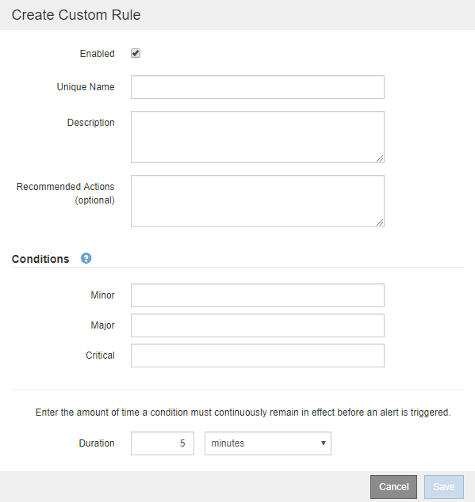

= Crie regras de alerta personalizadas
:allow-uri-read: 
:icons: font
:imagesdir: ../media/

[role="lead"]
Você pode criar regras de alerta personalizadas para definir suas próprias condições para acionar alertas.

.Antes de começar
* Você está conetado ao Gerenciador de Grade usando um link:../admin/web-browser-requirements.html["navegador da web suportado"].
* Você tem o link:../admin/admin-group-permissions.html["Gerencie alertas ou permissão de acesso root"].
* Você está familiarizado com o link:commonly-used-prometheus-metrics.html["Métricas de Prometheus comumente usadas"].
* Você entende o https://prometheus.io/docs/prometheus/latest/querying/basics/["Sintaxe das consultas Prometheus"^].
* Opcionalmente, você assistiu ao vídeo:
+
.Alertas personalizados
video::54af90c4-9a38-4136-9621-b1ff008604a3[panopto]

.Sobre esta tarefa
O StorageGRID não valida alertas personalizados. Se você decidir criar regras de alerta personalizadas, siga estas diretrizes gerais:

* Observe as condições para as regras de alerta padrão e use-as como exemplos para suas regras de alerta personalizadas.
* Se você definir mais de uma condição para uma regra de alerta, use a mesma expressão para todas as condições. Em seguida, altere o valor limite para cada condição.
* Verifique cuidadosamente cada condição para erros de digitação e lógica.
* Use apenas as métricas listadas na API de Gerenciamento de Grade.
* Ao testar uma expressão usando a API Grid Management, esteja ciente de que uma resposta "bem-sucedida" pode ser um corpo de resposta vazio (nenhum alerta acionado). Para ver se o alerta é realmente acionado, você pode definir temporariamente um limite para um valor que você espera ser verdadeiro atualmente.
+
Por exemplo, para testar a expressão `node_memory_MemTotal_bytes < 24000000000`, execute primeiro `node_memory_MemTotal_bytes >= 0` e certifique-se de obter os resultados esperados (todos os nós retornam um valor). Em seguida, altere o operador e o limite de volta para os valores pretendidos e execute novamente. Nenhum resultado indica que não há alertas atuais para essa expressão.

* Não assuma que um alerta personalizado está funcionando, a menos que você tenha validado que o alerta é acionado quando esperado.

.Passos
. Selecione *Alertas* > *Regras*.
+
A página regras de alerta é exibida.

. Selecione *criar regra personalizada*.
+
A caixa de diálogo criar regra personalizada é exibida.

+

. Marque ou desmarque a caixa de seleção *Enabled* para determinar se essa regra de alerta está ativada no momento.
+
Se uma regra de alerta estiver desativada, suas expressões não serão avaliadas e nenhum alerta será acionado.

. Introduza as seguintes informações:
+
[cols="1a,2a"]
|===
| Campo | Descrição 

 a| 
Nome único
 a| 
Um nome exclusivo para esta regra. O nome da regra de alerta é mostrado na página Alertas e também é o assunto das notificações por e-mail. Os nomes das regras de alerta podem ter entre 1 e 64 carateres.

 a| 
Descrição
 a| 
Uma descrição do problema que está ocorrendo. A descrição é a mensagem de alerta mostrada na página Alertas e nas notificações por e-mail. As descrições das regras de alerta podem ter entre 1 e 128 carateres.

 a| 
Ações recomendadas
 a| 
Opcionalmente, as ações recomendadas a serem tomadas quando esse alerta for acionado. Insira as ações recomendadas como texto simples (sem códigos de formatação). As ações recomendadas para regras de alerta podem ter entre 0 e 1.024 carateres.

|===
. Na seção condições, insira uma expressão Prometheus para um ou mais níveis de gravidade de alerta.
+
Uma expressão básica é geralmente da forma:

+
`[metric] [operator] [value]`

+
As expressões podem ter qualquer comprimento, mas aparecem em uma única linha na interface do usuário. Pelo menos uma expressão é necessária.

+
Esta expressão faz com que um alerta seja acionado se a quantidade de RAM instalada para um nó for inferior a 24.000.000.000 bytes (24 GB).

+
`node_memory_MemTotal_bytes < 24000000000`

+
Para ver as métricas disponíveis e testar expressões Prometheus, selecione o ícone de ajuda image:../media/icon_nms_question.png["ícone de ponto de interrogação"]e siga o link para a seção métricas da API de Gerenciamento de Grade.

. No campo *duração*, insira o período de tempo em que uma condição deve permanecer em vigor continuamente antes que o alerta seja acionado e selecione uma unidade de tempo.
+
Para acionar um alerta imediatamente quando uma condição se tornar verdadeira, digite *0*. Aumente esse valor para evitar que condições temporárias acionem alertas.

+
O padrão é 5 minutos.

. Selecione *Guardar*.
+
A caixa de diálogo fecha-se e a nova regra de alerta personalizada aparece na tabela regras de alerta.

