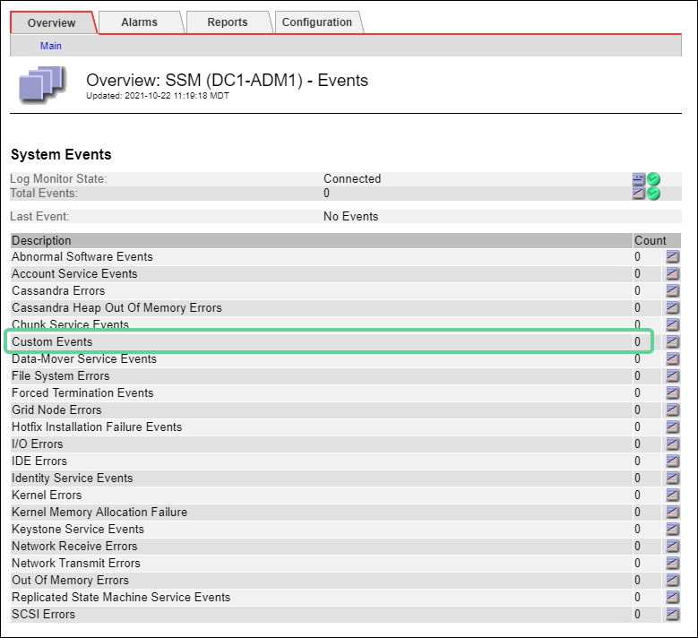

= Monitorar eventos
:allow-uri-read: 
:icons: font
:imagesdir: ../media/

[role="lead"]
Você pode monitorar eventos que são detetados por um nó de grade, incluindo eventos personalizados que você criou para rastrear eventos registrados no servidor syslog. A mensagem último evento mostrada no Gerenciador de Grade fornece mais informações sobre o evento mais recente.

As mensagens de evento também são listadas no `/var/local/log/bycast-err.log` arquivo de log. Consulte link:logs-files-reference.html["Referência de ficheiros de registo"].

O alarme SMTT (Total de eventos) pode ser repetidamente acionado por problemas como problemas de rede, interrupções de energia ou atualizações. Esta seção tem informações sobre a investigação de eventos para que você possa entender melhor por que esses alarmes ocorreram. Se um evento ocorreu devido a um problema conhecido, é seguro redefinir os contadores de eventos.

.Passos
. Revise os eventos do sistema para cada nó de grade:
+
.. Selecione *SUPPORT* > *Tools* > *Grid topology*.
.. Selecione *_site_* > *_grid node_* > *SSM* > *Eventos* > *Visão geral* > *Principal*.

. Gere uma lista de mensagens de eventos anteriores para ajudar a isolar problemas que ocorreram no passado:
+
.. Selecione *SUPPORT* > *Tools* > *Grid topology*.
.. Selecione *_site_* > *_grid node_* > *SSM* > *Eventos* > *relatórios*.
.. Selecione *texto*.
+
O atributo *último evento* não é mostrado no link:using-charts-and-reports.html["vista de gráficos"]. Para visualizá-lo:

.. Altere *Atributo* para *último evento*.
.. Opcionalmente, selecione um período de tempo para *consulta rápida*.
.. Selecione *Atualizar*.
+
image::../media/events_report.gif[Página de eventos]

== Crie eventos syslog personalizados

Eventos personalizados permitem que você acompanhe todos os eventos de usuário do kernel, daemon, erro e nível crítico registrados no servidor syslog. Um evento personalizado pode ser útil para monitorar a ocorrência de mensagens de log do sistema (e, portanto, eventos de segurança de rede e falhas de hardware).

.Sobre esta tarefa
Considere criar eventos personalizados para monitorar problemas recorrentes. As considerações a seguir se aplicam a eventos personalizados.

* Depois que um evento personalizado é criado, cada ocorrência dele é monitorada.
* Para criar um evento personalizado com base em palavras-chave nos `/var/local/log/messages` arquivos, os logs nesses arquivos devem ser:
+
** Gerado pelo kernel
** Gerado pelo daemon ou programa do usuário no nível de erro ou crítico

*Nota:* nem todas as entradas nos `/var/local/log/messages` arquivos serão correspondidas a menos que satisfaçam os requisitos acima indicados.

.Passos
. Selecione *SUPPORT* > *Alarmes (legacy)* > *Custom events*.
. Clique em *Edit* image:../media/icon_nms_edit.gif["ícone de lápis"](ou *Insert* image:../media/icon_nms_insert.gif["ícone plus"] se este não for o primeiro evento).
. Introduza uma cadeia de eventos personalizada, por exemplo, encerramento
+
image::../media/custom_events.png[captura de tela mostrando onde inserir string de evento personalizado]

. Selecione *aplicar alterações*.
. Selecione *SUPPORT* > *Tools* > *Grid topology*.
. Selecione *_grid node_* > *SSM* > *Eventos*.
. Localize a entrada de Eventos personalizados na tabela Eventos e monitore o valor de *Count*.
+
Se a contagem aumentar, um evento personalizado que você está monitorando está sendo acionado nesse nó de grade.

+

== Redefina a contagem de eventos personalizados para zero

Se você quiser redefinir o contador apenas para eventos personalizados, use a página topologia de grade no menu suporte.

A reposição de um contador faz com que o alarme seja acionado pelo próximo evento. Em contraste, quando você reconhece um alarme, esse alarme só é reacionado se o próximo nível de limiar for atingido.

.Passos
. Selecione *SUPPORT* > *Tools* > *Grid topology*.
. Selecione *_grid node_* > *SSM* > *Eventos* > *Configuração* > *Principal*.
. Marque a caixa de seleção *Reset* para Eventos personalizados.
+
image::../media/custom_events_reset.gif[Captura de ecrã em SSM > Eventos > Configuração > Principal]

. Selecione *aplicar alterações*.

