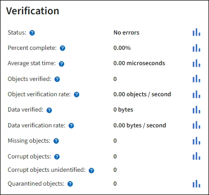
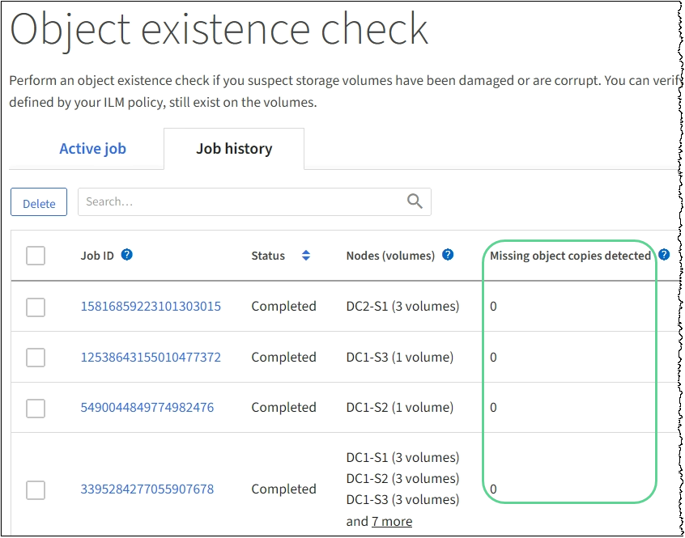

= Monitorar operações de verificação de objetos
:allow-uri-read: 
:icons: font
:imagesdir: ../media/

[role="lead"]
O sistema StorageGRID pode verificar a integridade dos dados de objetos nos nós de storage, verificando se há objetos corrompidos ou ausentes.

.Antes de começar
* Você está conetado ao Gerenciador de Grade usando um link:../admin/web-browser-requirements.html["navegador da web suportado"].
* Você tem o link:../admin/admin-group-permissions.html["Permissão de manutenção ou acesso root"].

.Sobre esta tarefa
Dois link:../troubleshoot/verifying-object-integrity.html["processos de verificação"] trabalham juntos para garantir a integridade dos dados:

* * A verificação em segundo plano* é executada automaticamente, verificando continuamente a correção dos dados do objeto.
+
A verificação em segundo plano verifica automaticamente e continuamente todos os nós de storage para determinar se há cópias corrompidas de dados de objetos replicados e codificados por apagamento. Se forem encontrados problemas, o sistema StorageGRID tentará substituir automaticamente os dados de objetos corrompidos de cópias armazenadas em outro lugar do sistema. A verificação em segundo plano não é executada em objetos em um pool de armazenamento em nuvem.

+

NOTE: O alerta *Objeto corrompido não identificado detetado* é acionado se o sistema detetar um objeto corrompido que não pode ser corrigido automaticamente.

* *A verificação de existência de objetos* pode ser acionada por um usuário para verificar mais rapidamente a existência (embora não a correção) de dados de objetos.
+
A verificação de existência de objeto verifica se todas as cópias replicadas esperadas de objetos e fragmentos codificados por apagamento existem em um nó de storage. A verificação de existência de objeto fornece uma maneira de verificar a integridade dos dispositivos de armazenamento, especialmente se um problema recente de hardware poderia ter afetado a integridade dos dados.

Você deve rever os resultados de verificações de antecedentes e verificações de existência de objetos regularmente. Investigue quaisquer instâncias de dados de objetos corrompidos ou ausentes imediatamente para determinar a causa raiz.

.Passos
. Reveja os resultados das verificações de antecedentes:
+
.. Selecione *NODES* > *_Storage Node_* > *Objects*.
.. Verifique os resultados da verificação:
+
*** Para verificar a verificação de dados de objetos replicados, observe os atributos na seção Verificação.
+

*** Para verificar a verificação de fragmentos codificados por apagamento, selecione *_Storage Node_* > *ILM* e veja os atributos na seção de verificação de codificação de apagamento.
+
image::../media/nodes_storage_node_ilm_ec_verification.png[Nós > nó de storage > ILM > Verificação de EC]

+
Selecione o ponto de interrogação image:../media/icon_nms_question.png["ponto de interrogação"]ao lado do nome de um atributo para exibir o texto da ajuda.

. Reveja os resultados dos trabalhos de verificação de existência de objeto:
+
.. Selecione *MAINTENANCE* > *Object existence check* > *Job history*.
.. Digitalizar a coluna cópias de objeto em falta detetadas. Se algum trabalho resultar em 100 ou mais cópias de objetos ausentes e o alerta *objetos perdidos* tiver sido acionado, entre em Contato com o suporte técnico.
+

