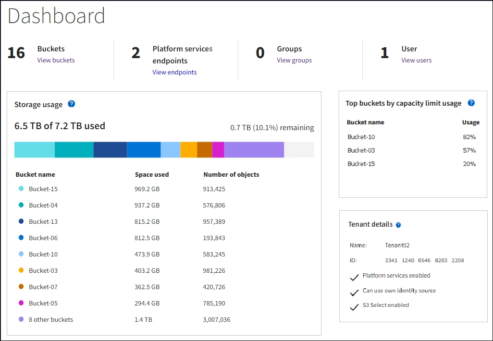
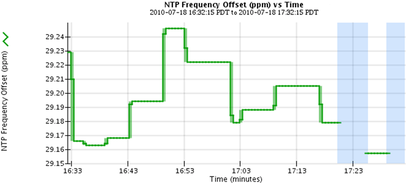

= Use gráficos e gráficos
:allow-uri-read: 
:icons: font
:imagesdir: ../media/

[role="lead"]
Você pode usar gráficos e relatórios para monitorar o estado do sistema StorageGRID e solucionar problemas.

NOTE: O Gerenciador de Grade é atualizado com cada versão e pode não corresponder às capturas de tela de exemplo nesta página.

== Tipos de gráficos

Gráficos e gráficos resumem os valores de métricas e atributos específicos do StorageGRID.

O painel do Gerenciador de Grade inclui cartões que resumem o armazenamento disponível para a grade e cada local.

image::../media/dashboard_data_and_metadata_space_usage_breakdown.png[Divisão da utilização de espaço de metadados e dados do dashboard]

O painel uso do armazenamento no painel do Gerenciador do locatário exibe o seguinte:

* Uma lista dos maiores baldes (S3) ou contentores (Swift) para o inquilino
* Um gráfico de barras que representa os tamanhos relativos dos maiores baldes ou contentores
* A quantidade total de espaço utilizado e, se for definida uma quota, a quantidade e a percentagem de espaço restante

Além disso, gráficos que mostram como as métricas e atributos do StorageGRID mudam ao longo do tempo estão disponíveis na página de nós e na página *SUPPORT* > *Tools* > *Grid topology*.

Existem quatro tipos de gráficos:

* *Gráficos Grafana*: Mostrados na página de nós, gráficos Grafana são usados para plotar os valores das métricas Prometheus ao longo do tempo. Por exemplo, a guia *NÓS* > *rede* para um nó de armazenamento inclui um gráfico Grafana para tráfego de rede.
+
image::../media/nodes_page_network_tab.png[Página de nós separador rede]

+

NOTE: Gráficos Grafana também estão incluídos nos painéis pré-construídos disponíveis na página *SUPPORT* > *Tools* > *Metrics*.

* *Gráficos de linha*: Disponíveis na página de nós e na página *SUPPORT* > *Tools* > *Grid topoly* (selecione o ícone do gráfico image:../media/icon_chart_new_for_11_5.png["Gráfico de ícones (novo)"]após um valor de dados), os gráficos de linha são usados para plotar os valores dos atributos StorageGRID que têm um valor unitário (como deslocamento de frequência NTP, em ppm). As alterações no valor são plotadas em intervalos de dados regulares (bins) ao longo do tempo.
+

* *Gráficos de área*: Disponíveis na página de nós e na página *SUPPORT* > *Tools* > *Grid topology* (selecione o ícone do gráfico image:../media/icon_chart_new_for_11_5.png["Gráfico de ícones (novo)"]após um valor de dados), os gráficos de área são usados para plotar quantidades de atributos volumétricos, como contagens de objetos ou valores de carga de serviço. Os gráficos de área são semelhantes aos gráficos de linha, mas incluem um sombreamento marrom claro abaixo da linha. As alterações no valor são plotadas em intervalos de dados regulares (bins) ao longo do tempo.
+
image::../media/area_graph.gif[Gráfico de área]

* Alguns gráficos são denotados com um tipo diferente de ícone de gráfico image:../media/icon_chart_new_for_11_5.png["Ícone de carta"]e têm um formato diferente:
+
image::../media/charts_lost_object_detected.png[Objetos perdidos gráficos detetados]

* *State graph*: Disponível na página *SUPPORT* > *Tools* > *Grid topoly* (selecione o ícone do gráfico image:../media/icon_chart_new_for_11_5.png["Gráfico de ícones (novo)"]após um valor de dados), os gráficos de estado são usados para plotar valores de atributo que representam estados distintos, como um estado de serviço que pode ser on-line, standby ou offline. Os gráficos de estado são semelhantes aos gráficos de linha, mas a transição é descontínua, ou seja, o valor salta de um valor de estado para outro.
+
image::../media/state_graph.gif[Gráfico de Estado]

.Informações relacionadas
* link:viewing-nodes-page.html["Exibir a página nós"]
* link:viewing-grid-topology-tree.html["Veja a árvore de topologia de Grade"]
* link:reviewing-support-metrics.html["Analise as métricas de suporte"]

== Legenda da carta

As linhas e cores usadas para desenhar gráficos têm significado específico.

[cols="1a,3a"]
|===
| Exemplo | Significado 

 a| 
image:../media/dark_green_chart_line.gif["captura de tela mostrando linha verde escura"]
 a| 
Os valores de atributo relatados são plotados usando linhas verdes escuras.

 a| 
image:../media/light_green_chart_line.gif["captura de tela mostrando sombreamento que indica binning de dados"]
 a| 
O sombreamento verde claro em torno de linhas verdes escuras indica que os valores reais nesse intervalo de tempo variam e foram "encadernados" para plotagem mais rápida. A linha escura representa a média ponderada. O intervalo em verde claro indica os valores máximo e mínimo dentro do compartimento. O sombreamento castanho claro é usado para gráficos de área para indicar dados volumétricos.

 a| 
image:../media/no_data_plotted_chart.gif["captura de tela mostrando áreas em branco na linha de plotagem"]
 a| 
Áreas em branco (sem dados plotados) indicam que os valores do atributo não estavam disponíveis. O fundo pode ser azul, cinza ou uma mistura de cinza e azul, dependendo do estado do serviço que relata o atributo.

 a| 
image:../media/light_blue_chart_shading.gif["captura de tela mostrando sombreamento azul claro indicando valores indeterminados"]
 a| 
O sombreamento azul claro indica que alguns ou todos os valores do atributo naquele momento eram indeterminados; o atributo não estava relatando valores porque o serviço estava em um estado desconhecido.

 a| 
image:../media/gray_chart_shading.gif["captura de tela mostrando sombreamento cinza devido a valores desconhecidos"]
 a| 
O sombreamento cinza indica que alguns ou todos os valores de atributo naquele momento não eram conhecidos porque o serviço que relata os atributos estava administrativamente inativo.

 a| 
image:../media/gray_blue_chart_shading.gif["captura de tela mostrando a mistura de valores indeterminados e desconhecidos"]
 a| 
Uma mistura de sombreamento cinza e azul indica que alguns dos valores de atributo na época eram indeterminados (porque o serviço estava em um estado desconhecido), enquanto outros não eram conhecidos porque o serviço relatando os atributos estava administrativamente para baixo.

|===

== Apresentar gráficos e gráficos

A página nós contém os gráficos e gráficos que você deve acessar regularmente para monitorar atributos como capacidade de storage e taxa de transferência. Em alguns casos, especialmente ao trabalhar com suporte técnico, você pode usar a página *SUPPORT* > *Tools* > *Grid topology* para acessar gráficos adicionais.

.Antes de começar
Você deve estar conetado ao Gerenciador de Grade usando um link:../admin/web-browser-requirements.html["navegador da web suportado"].

.Passos
. Selecione *NODES*. Em seguida, selecione um nó, um site ou toda a grade.
. Selecione o separador para o qual pretende ver as informações.
+
Algumas guias incluem um ou mais gráficos Grafana, que são usados para plotar os valores das métricas de Prometheus ao longo do tempo. Por exemplo, a guia *NÓS* > *hardware* de um nó inclui dois gráficos Grafana.

+
image::../media/nodes_page_hardware_tab_graphs.png[Gráficos do separador hardware da página de nós]

. Opcionalmente, posicione o cursor sobre o gráfico para ver valores mais detalhados para um determinado ponto no tempo.
+
image::../media/nodes_page_memory_usage_details.png[Detalhes de uso da memória da página de nós]

. Conforme necessário, muitas vezes é possível exibir um gráfico para um atributo ou métrica específico. Na tabela na página nós, selecione o ícone do gráfico image:../media/icon_chart_new_for_11_5.png["Ícone de carta"]à direita do nome do atributo.
+

NOTE: Os gráficos não estão disponíveis para todas as métricas e atributos.

+
*Exemplo 1*: Na guia objetos de um nó de armazenamento, você pode selecionar o ícone do gráfico image:../media/icon_chart_new_for_11_5.png["Ícone de carta"]para ver o número total de consultas de armazenamento de metadados bem-sucedidas para o nó de armazenamento.

+
image::../media/nodes_page_objects_successful_metadata_queries.png[Consultas de metadados bem-sucedidas]

+
image::../media/nodes_page-objects_chart_successful_metadata_queries.png[Gráficos consultas de metadados bem-sucedidas]

+
*Exemplo 2*: Na guia objetos de um nó de armazenamento, você pode selecionar o ícone do gráfico image:../media/icon_chart_new_for_11_5.png["Ícone de carta"]para ver o gráfico Grafana da contagem de objetos perdidos detetados ao longo do tempo.

+
image::../media/object_count_table.png[Tabela contagem de objetos]

+
image::../media/charts_lost_object_detected.png[Objetos perdidos gráficos detetados]

. Para exibir gráficos para atributos que não são exibidos na página nó, selecione *support* > *Tools* > *Grid topoly*.
. Selecione *_grid node_* > *_component ou Service_* > *Overview* > *Main*.
+
image::../media/nms_chart.gif[captura de tela descrita pelo texto circundante]

. Selecione o ícone do gráfico image:../media/icon_chart_new_for_11_5.png["Ícone de carta"]ao lado do atributo.
+
O visor muda automaticamente para a página *relatórios* > *gráficos*. O gráfico exibe os dados do atributo no último dia.

== Gerar gráficos

Os gráficos exibem uma representação gráfica dos valores de dados de atributos. Você pode gerar relatórios em um local de data center, nó de grade, componente ou serviço.

.Antes de começar
* Você deve estar conetado ao Gerenciador de Grade usando um link:../admin/web-browser-requirements.html["navegador da web suportado"].
* Você link:../admin/admin-group-permissions.html["permissões de acesso específicas"]tem .

.Passos
. Selecione *SUPPORT* > *Tools* > *Grid topology*.
. Selecione *_grid node_* > *_component ou Service_* > *Reports* > *Charts*.
. Selecione o atributo para relatar na lista suspensa *Atributo*.
. Para forçar o eixo Y a iniciar em zero, desmarque a caixa de seleção *vertical Scaling*.
. Para mostrar valores com precisão total, marque a caixa de seleção *dados brutos* ou arredondar valores para um máximo de três casas decimais (por exemplo, para atributos reportados como porcentagens), desmarque a caixa de seleção *dados brutos*.
. Selecione o período de tempo para relatar na lista suspensa *consulta rápida*.
+
Selecione a opção consulta personalizada para selecionar um intervalo de tempo específico.

+
O gráfico aparece após alguns momentos. Aguarde vários minutos para a tabulação de longos intervalos de tempo.

. Se você selecionou consulta personalizada, personalize o período de tempo para o gráfico inserindo *Data de início* e *Data de término*.
+
Utilize o formato `_YYYY/MM/DDHH:MM:SS_` na hora local. Zeros à esquerda são necessários para corresponder ao formato. Por exemplo, 2017/4/6 7:30:00 falha na validação. O formato correto é: 2017/04/06 07:30:00.

. Selecione *Atualizar*.
+
Um gráfico é gerado após alguns segundos. Aguarde vários minutos para a tabulação de longos intervalos de tempo. Dependendo do período de tempo definido para a consulta, um relatório de texto bruto ou um relatório de texto agregado são exibidos.

