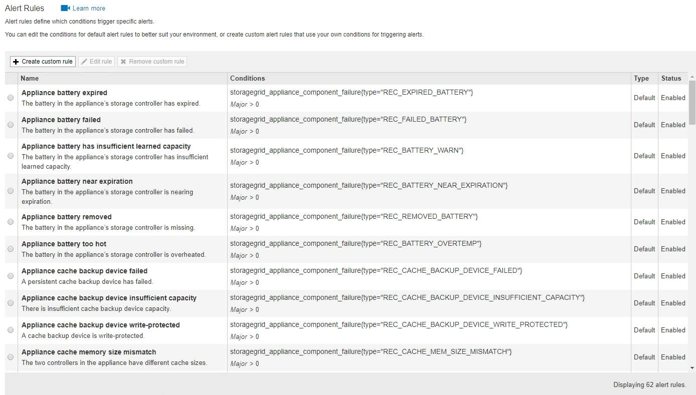

= Ver regras de alerta
:allow-uri-read: 
:icons: font
:imagesdir: ../media/

[role="lead"]
As regras de alerta definem as condições que acionam link:alerts-reference.html["alertas específicos"]o . O StorageGRID inclui um conjunto de regras de alerta padrão, que você pode usar como está ou modificar, ou você pode criar regras de alerta personalizadas.

Você pode ver a lista de todas as regras de alerta padrão e personalizado para saber quais condições acionarão cada alerta e para ver se algum alerta está desativado.

.Antes de começar
* Você está conetado ao Gerenciador de Grade usando um link:../admin/web-browser-requirements.html["navegador da web suportado"].
* Você tem o link:../admin/admin-group-permissions.html["Gerencie alertas ou permissão de acesso root"].
* Opcionalmente, você assistiu ao vídeo: https://netapp.hosted.panopto.com/Panopto/Pages/Viewer.aspx?id=2eea81c5-8323-417f-b0a0-b1ff008506c1["Vídeo: Visão geral dos alertas"^]
+
[link=https://netapp.hosted.panopto.com/Panopto/Pages/Viewer.aspx?id=2eea81c5-8323-417f-b0a0-b1ff008506c1]
image::../media/video-screenshot-alert-overview-118.png[Vídeo: Visão geral dos alertas]

.Passos
. Selecione *ALERTAS* > *regras*.
+
A página regras de alerta é exibida.

+

. Reveja as informações na tabela de regras de alerta:
+
[cols="1a,3a"]
|===
| Cabeçalho da coluna | Descrição 

 a| 
Nome
 a| 
O nome exclusivo e a descrição da regra de alerta. As regras de alerta personalizadas são listadas primeiro, seguidas pelas regras de alerta padrão. O nome da regra de alerta é o assunto das notificações por e-mail.

 a| 
Condições
 a| 
As expressões Prometheus que determinam quando esse alerta é acionado. Um alerta pode ser acionado em um ou mais dos seguintes níveis de gravidade, mas não é necessária uma condição para cada gravidade.

** *Crítico* image:../media/icon_alert_red_critical.png["Ícone Alerta Vermelho crítico"]: existe uma condição anormal que interrompeu as operações normais de um nó ou serviço StorageGRID. Você deve abordar o problema subjacente imediatamente. A interrupção do serviço e a perda de dados podem resultar se o problema não for resolvido.
** *Major* image:../media/icon_alert_orange_major.png["Ícone Alerta Laranja maior"]: existe uma condição anormal que está afetando as operações atuais ou se aproximando do limite para um alerta crítico. Você deve investigar os principais alertas e resolver quaisquer problemas subjacentes para garantir que a condição anormal não pare a operação normal de um nó ou serviço StorageGRID.
** *Minor* image:../media/icon_alert_yellow_minor.png["Ícone Alerta Amarelo menor"]: o sistema está operando normalmente, mas existe uma condição anormal que pode afetar a capacidade do sistema de operar se ele continuar. Você deve monitorar e resolver alertas menores que não sejam claros por conta própria para garantir que eles não resultem em um problema mais sério.

 a| 
Tipo
 a| 
O tipo de regra de alerta:

** *Default*: Uma regra de alerta fornecida com o sistema. Você pode desativar uma regra de alerta padrão ou editar as condições e a duração de uma regra de alerta padrão. Não é possível remover uma regra de alerta padrão.
** *Padrão**: Uma regra de alerta padrão que inclui uma condição ou duração editada. Conforme necessário, você pode reverter facilmente uma condição modificada de volta ao padrão original.
** *Custom*: Uma regra de alerta que você criou. Você pode desativar, editar e remover regras de alerta personalizadas.

 a| 
Estado
 a| 
Se esta regra de alerta está atualmente ativada ou desativada. As condições para regras de alerta desativadas não são avaliadas, portanto, nenhum alerta é acionado.

|===

