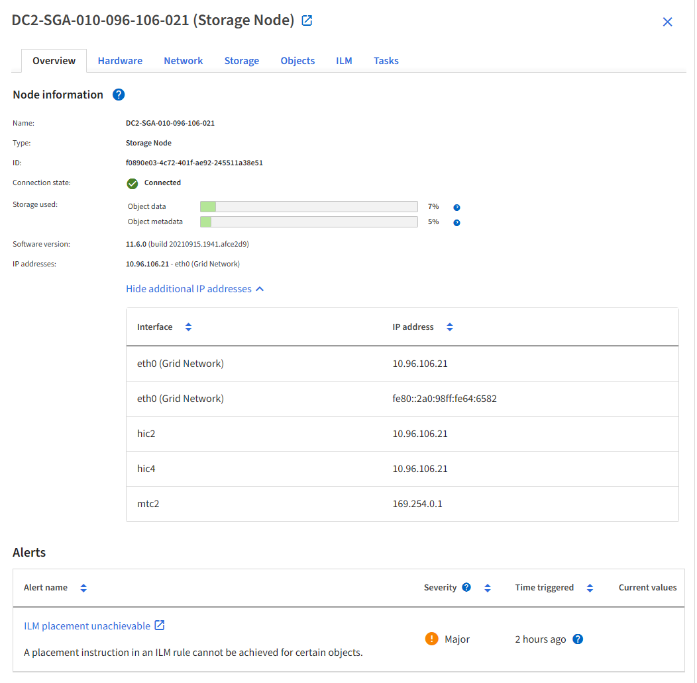
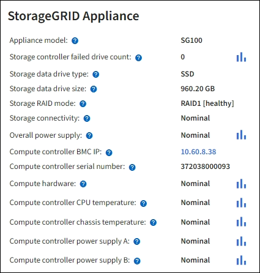
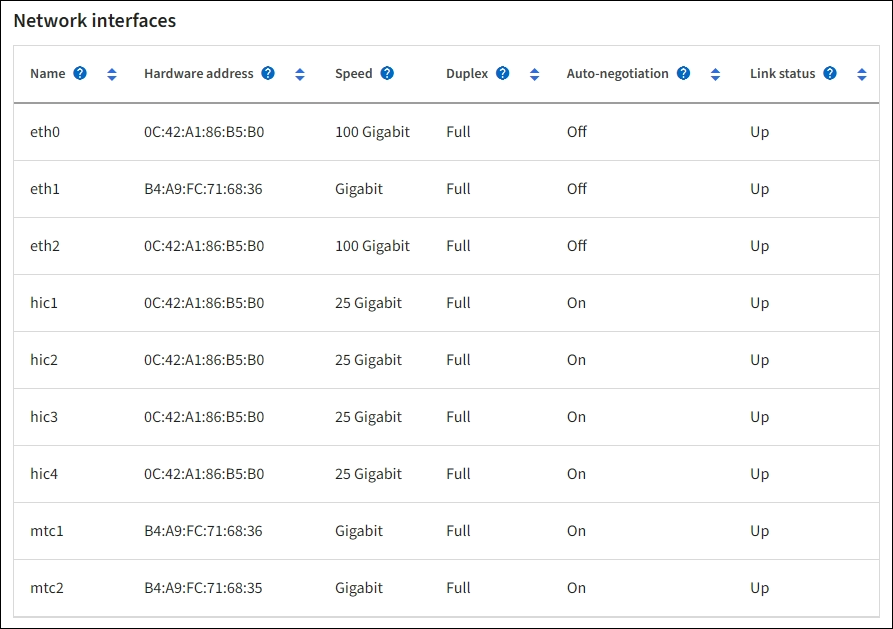

= Exibir a guia hardware
:allow-uri-read: 
:icons: font
:imagesdir: ../media/

[role="lead"]
A guia hardware exibe a utilização da CPU e o uso da memória para cada nó e informações adicionais de hardware sobre dispositivos.

NOTE: O Gerenciador de Grade é atualizado com cada versão e pode não corresponder às capturas de tela de exemplo nesta página.

A guia hardware é exibida para todos os nós.

image::../media/nodes_page_hardware_tab_graphs.png[Guia hardware da página de nós]

Para exibir um intervalo de tempo diferente, selecione um dos controles acima do gráfico ou gráfico. Você pode exibir as informações disponíveis para intervalos de 1 hora, 1 dia, 1 semana ou 1 mês. Você também pode definir um intervalo personalizado, que permite especificar intervalos de data e hora.

Para ver detalhes sobre a utilização da CPU e o uso da memória, posicione o cursor sobre cada gráfico.

image::../media/nodes_page_memory_usage_details.png[Página de nós > hardware > Detalhes de uso da memória]

Se o nó for um nó de dispositivo, essa guia também inclui uma seção com mais informações sobre o hardware do dispositivo.

== Exibir informações sobre os nós de storage do dispositivo

A página nós lista informações sobre a integridade do serviço e todos os recursos computacionais, de dispositivo de disco e de rede para cada nó de storage do dispositivo. Você também pode ver memória, hardware de armazenamento, versão do firmware do controlador, recursos de rede, interfaces de rede, endereços de rede e receber e transmitir dados.

.Passos
. Na página nós, selecione um nó de storage do dispositivo.
. Selecione *Visão geral*.
+
A seção informações do nó da guia Visão geral exibe informações resumidas do nó, como nome, tipo, ID e estado da conexão do nó. A lista de endereços IP inclui o nome da interface para cada endereço, da seguinte forma:

+
** *eth*: Rede de Grade, rede Admin ou rede de cliente.
** *Hic*: Uma das portas físicas de 10, 25 ou 100 GbE no dispositivo. Estas portas podem ser Unidas e ligadas à rede de grelha StorageGRID (eth0) e à rede de clientes (eth2).
** *mtc*: Uma das portas físicas de 1 GbE no dispositivo. Uma ou mais interfaces mtc são ligadas para formar a interface de rede de administração do StorageGRID (eth1). Pode deixar outras interfaces mtc disponíveis para conetividade local temporária para um técnico no centro de dados.
+

+
A seção Alertas da guia Visão geral exibe quaisquer alertas ativos para o nó.

. Selecione *hardware* para ver mais informações sobre o aparelho.
+
.. Visualize os gráficos de utilização da CPU e memória para determinar as percentagens de utilização da CPU e da memória ao longo do tempo. Para exibir um intervalo de tempo diferente, selecione um dos controles acima do gráfico ou gráfico. Você pode exibir as informações disponíveis para intervalos de 1 hora, 1 dia, 1 semana ou 1 mês. Você também pode definir um intervalo personalizado, que permite especificar intervalos de data e hora.
+
image::../media/nodes_page_hardware_tab_graphs.png[Gráficos de hardware]

.. Role para baixo para ver a tabela de componentes do aparelho. Esta tabela contém informações como o nome do modelo do aparelho; nomes do controlador, números de série e endereços IP; e o status de cada componente.
+

NOTE: Alguns campos, como o BMC IP do controlador de computação e o hardware de computação, aparecem apenas para dispositivos com esse recurso.

+
Os componentes das prateleiras de armazenamento e das prateleiras de expansão, se fizerem parte da instalação, aparecerão em uma tabela separada abaixo da tabela do dispositivo.

+
image::../media/nodes_page_hardware_tab_for_appliance.png[Guia hardware da página de nós para o dispositivo]

+
[cols="1a,2a"]
|===
| Campo na mesa do aparelho | Descrição 

 a| 
Modelo do aparelho
 a| 
O número do modelo para este dispositivo StorageGRID mostrado no SANtricity os.

 a| 
Nome do controlador de storage
 a| 
O nome deste dispositivo StorageGRID mostrado no SANtricity os.

 a| 
Um IP de gerenciamento do controlador de armazenamento
 a| 
Endereço IP da porta de gerenciamento 1 no controlador de armazenamento A. você usa esse IP para acessar o SANtricity os para solucionar problemas de armazenamento.

 a| 
IP de gerenciamento B do controlador de armazenamento
 a| 
Endereço IP da porta de gerenciamento 1 no controlador de storage B. você usa esse IP para acessar o SANtricity os para solucionar problemas de storage.

Alguns modelos de aparelhos não têm um controlador de armazenamento B..

 a| 
Controlador de armazenamento WWID
 a| 
O identificador mundial do controlador de storage mostrado no SANtricity os.

 a| 
Número de série do chassi do dispositivo de armazenamento
 a| 
O número de série do chassis do aparelho.

 a| 
Versão do firmware do controlador de armazenamento
 a| 
A versão do firmware no controlador de armazenamento para este dispositivo.

 a| 
Versão do controlador de storage SANtricity os
 a| 
A versão do SANtricity os do controlador de armazenamento A..

 a| 
Versão NVSRAM da controladora de storage
 a| 
Versão NVSRAM da controladora de armazenamento conforme relatado pelo Gerenciador de sistema do SANtricity.

Para o SG6060 e SG6160, se houver uma incompatibilidade de versão NVSRAM entre os dois controladores, a versão do controlador A será exibida. Se o controlador A não estiver instalado ou operacional, a versão do controlador B será exibida.

 a| 
Hardware de storage
 a| 
O status geral do hardware do controlador de storage. Se o Gerenciador de sistema do SANtricity relatar um status de precisa de atenção para o hardware de storage, o sistema StorageGRID também informará esse valor.

Se o status for "precisa de atenção", primeiro verifique o controlador de armazenamento usando o SANtricity os. Em seguida, certifique-se de que não existem outros alertas que se apliquem ao controlador de computação.

 a| 
Falha na contagem de unidades do controlador de armazenamento
 a| 
O número de unidades que não são ideais.

 a| 
Controlador de Storage A
 a| 
O status do controlador de armazenamento A..

 a| 
Controlador de armazenamento B
 a| 
O status do controlador de armazenamento B. alguns modelos de aparelhos não têm um controlador de armazenamento B.

 a| 
Fonte de Alimentação do controlador de armazenamento A
 a| 
O estado da fonte de Alimentação A para o controlador de armazenamento.

 a| 
Fonte de alimentação B do controlador de armazenamento
 a| 
O estado da fonte de alimentação B para o controlador de armazenamento.

 a| 
Tipo de unidade de dados de armazenamento
 a| 
O tipo de unidades no dispositivo, como HDD (disco rígido) ou SSD (unidade de estado sólido).

 a| 
Tamanho da unidade de dados de armazenamento
 a| 
O tamanho efetivo de uma unidade de dados.

Para o SG6160, o tamanho da unidade de cache também é exibido.

*Nota*: Para nós com compartimentos de expansão, use o <<shelf_data_drive_size,Tamanho da unidade de dados para cada gaveta>> em vez disso. O tamanho efetivo da unidade pode ser diferente por gaveta.

 a| 
Modo RAID de armazenamento
 a| 
O modo RAID configurado para o dispositivo.

 a| 
Conectividade de storage
 a| 
O estado de conetividade de storage.

 a| 
Fonte de alimentação geral
 a| 
O estado de todas as fontes de alimentação do aparelho.

 a| 
Controlador de computação BMC IP
 a| 
O endereço IP da porta do controlador de gerenciamento de placa base (BMC) no controlador de computação. Você usa esse IP para se conetar à interface do BMC para monitorar e diagnosticar o hardware do dispositivo.

Este campo não é apresentado para modelos de aparelhos que não contêm um BMC.

 a| 
Número de série do controlador de computação
 a| 
O número de série do controlador de computação.

 a| 
Hardware de computação
 a| 
O status do hardware do controlador de computação. Esse campo não é exibido para modelos de dispositivo que não têm hardware de computação e hardware de armazenamento separados.

 a| 
Temperatura da CPU do controlador de computação
 a| 
O status da temperatura da CPU do controlador de computação.

 a| 
Temperatura do chassi do controlador de computação
 a| 
O status da temperatura do controlador de computação.

|===
+
[cols="1a,2a"]
|===
| Coluna na tabela prateleiras de armazenamento | Descrição 

 a| 
Número de série do chassi do compartimento
 a| 
O número de série do chassi do compartimento de armazenamento.

 a| 
ID do compartimento
 a| 
O identificador numérico da prateleira de armazenamento.

*** 99: Compartimento do controlador de storage
*** 0: Primeira prateleira de expansão
*** 1: Segunda prateleira de expansão

*Nota:* as prateleiras de expansão aplicam-se apenas aos modelos SG6060 e SG6160.

 a| 
Status do compartimento
 a| 
O status geral da gaveta de storage.

 a| 
Estado IOM
 a| 
O status dos módulos de entrada/saída (IOMs) em quaisquer prateleiras de expansão. N/A se este não for um compartimento de expansão.

 a| 
Estado da fonte de alimentação
 a| 
O status geral das fontes de alimentação para o compartimento de armazenamento.

 a| 
Estado da gaveta
 a| 
O estado das gavetas na prateleira de arrumação. N/A se a prateleira não contiver gavetas.

 a| 
Estado da ventoinha
 a| 
O status geral dos ventiladores de resfriamento na prateleira de armazenamento.

 a| 
Slots de unidade
 a| 
O número total de slots de unidade no compartimento de armazenamento.

 a| 
Unidades de dados
 a| 
O número de unidades no compartimento de storage usadas para o storage de dados.

 a| 
[[shelf_data_drive_size]]tamanho da unidade de dados
 a| 
O tamanho efetivo de uma unidade de dados no compartimento de storage.

 a| 
Unidades de cache
 a| 
O número de unidades no compartimento de armazenamento que são usadas como cache.

 a| 
Tamanho da unidade de cache
 a| 
O tamanho da menor unidade de cache no compartimento de armazenamento. Normalmente, as unidades de cache têm o mesmo tamanho.

 a| 
Estado da configuração
 a| 
O status de configuração do compartimento de storage.

|===
.. Confirmar se todos os Estados são "nominais".
+
Se um estado não for "nominal", reveja quaisquer alertas atuais. Você também pode usar o Gerenciador de sistema do SANtricity para saber mais sobre alguns desses valores de hardware. Consulte as instruções para instalar e manter o seu aparelho.

. Selecione *rede* para ver as informações de cada rede.
+
O gráfico tráfego de rede fornece um resumo do tráfego de rede geral.

+
image::../media/nodes_page_network_traffic_graph.png[Gráfico de tráfego de rede da página de nós]

+
.. Reveja a secção interfaces de rede.
+
image::../media/nodes_page_network_interfaces.png[Interfaces de rede da página de nós]

+
Use a tabela a seguir com os valores na coluna *velocidade* na tabela interfaces de rede para determinar se as portas de rede 10/25-GbE no dispositivo foram configuradas para usar o modo ativo/backup ou o modo LACP.

+

NOTE: Os valores mostrados na tabela assumem que todos os quatro links são usados.

+
[cols="1a,1a,1a,1a"]
|===
| Modo de ligação | Modo Bond | Velocidade de ligação HIC individual (hic1, hic2, hic3, hic4) | Velocidade esperada da rede do cliente/grade (eth0,eth2) 

 a| 
Agregado
 a| 
LACP
 a| 
25
 a| 
100

 a| 
Fixo
 a| 
LACP
 a| 
25
 a| 
50

 a| 
Fixo
 a| 
Ativo/Backup
 a| 
25
 a| 
25

 a| 
Agregado
 a| 
LACP
 a| 
10
 a| 
40

 a| 
Fixo
 a| 
LACP
 a| 
10
 a| 
20

 a| 
Fixo
 a| 
Ativo/Backup
 a| 
10
 a| 
10

|===
+
Consulte https://docs.netapp.com/us-en/storagegrid-appliances/installconfig/configuring-network-links.html["Configurar ligações de rede"^] para obter mais informações sobre como configurar as portas 10/25-GbE.

.. Reveja a secção Comunicação de rede.
+
As tabelas de receção e transmissão mostram quantos bytes e pacotes foram recebidos e enviados através de cada rede, bem como outras métricas de receção e transmissão.

+
image::../media/nodes_page_network_communication.png[Comunicação de rede de Página de nós]

. Selecione *armazenamento* para visualizar gráficos que mostram as porcentagens de armazenamento usadas ao longo do tempo para dados de objetos e metadados de objetos, bem como informações sobre dispositivos de disco, volumes e armazenamentos de objetos.
+
image::../media/nodes_page_storage_used_object_data.png[Armazenamento usado - dados do objeto]

+
image::../media/storage_used_object_metadata.png[Armazenamento usado - metadados Objeto]

+
.. Role para baixo para ver as quantidades de armazenamento disponível para cada volume e armazenamento de objetos.
+
O Nome Mundial para cada disco corresponde ao identificador mundial de volume (WWID) que aparece quando você visualiza propriedades de volume padrão no SANtricity os (o software de gerenciamento conetado ao controlador de armazenamento do dispositivo).

+
Para ajudá-lo a interpretar estatísticas de leitura e gravação de disco relacionadas aos pontos de montagem de volume, a primeira parte do nome mostrado na coluna *Nome* da tabela dispositivos de disco (ou seja, _sdc_, _sdd_, _sde_, etc.) corresponde ao valor mostrado na coluna *dispositivo* da tabela volumes.

+
image::../media/nodes_page_storage_tables.png[Tabelas de storage de páginas de nós]

== Exibir informações sobre os nós de administração do dispositivo e os nós de gateway

A página nós lista informações sobre a integridade do serviço e todos os recursos computacionais, de dispositivo de disco e de rede para cada dispositivo de serviços que é usado como nó de administrador ou nó de gateway. Você também pode ver memória, hardware de armazenamento, recursos de rede, interfaces de rede, endereços de rede e receber e transmitir dados.

.Passos
. Na página nós, selecione um nó de administração do dispositivo ou um nó de gateway do dispositivo.
. Selecione *Visão geral*.
+
A seção informações do nó da guia Visão geral exibe informações resumidas do nó, como nome, tipo, ID e estado da conexão do nó. A lista de endereços IP inclui o nome da interface para cada endereço, da seguinte forma:

+
** *Adllb* e *adlli*: Mostrado se a ligação ativa/backup é usada para a interface Admin Network
** *eth*: Rede de Grade, rede Admin ou rede de cliente.
** *Hic*: Uma das portas físicas de 10, 25 ou 100 GbE no dispositivo. Estas portas podem ser Unidas e ligadas à rede de grelha StorageGRID (eth0) e à rede de clientes (eth2).
** *mtc*: Uma das portas físicas de 1 GbE no dispositivo. Uma ou mais interfaces mtc são ligadas para formar a interface de rede Admin (eth1). Pode deixar outras interfaces mtc disponíveis para conetividade local temporária para um técnico no centro de dados.
+
image::../media/nodes_page_overview_tab_services_appliance.png[Guia Visão geral da página de nós para o dispositivo de serviços]

+
A seção Alertas da guia Visão geral exibe quaisquer alertas ativos para o nó.

. Selecione *hardware* para ver mais informações sobre o aparelho.
+
.. Visualize os gráficos de utilização da CPU e memória para determinar as percentagens de utilização da CPU e da memória ao longo do tempo. Para exibir um intervalo de tempo diferente, selecione um dos controles acima do gráfico ou gráfico. Você pode exibir as informações disponíveis para intervalos de 1 hora, 1 dia, 1 semana ou 1 mês. Você também pode definir um intervalo personalizado, que permite especificar intervalos de data e hora.
+
image::../media/nodes_page_hardware_tab_graphs_services_appliance.png[Gráficos da guia hardware da página de nós para o dispositivo de serviços]

.. Role para baixo para ver a tabela de componentes do aparelho. Esta tabela contém informações como o nome do modelo, o número de série, a versão do firmware do controlador e o status de cada componente.
+

+
[cols="1a,2a"]
|===
| Campo na mesa do aparelho | Descrição 

 a| 
Modelo do aparelho
 a| 
O número do modelo para este dispositivo StorageGRID.

 a| 
Falha na contagem de unidades do controlador de armazenamento
 a| 
O número de unidades que não são ideais.

 a| 
Tipo de unidade de dados de armazenamento
 a| 
O tipo de unidades no dispositivo, como HDD (disco rígido) ou SSD (unidade de estado sólido).

 a| 
Tamanho da unidade de dados de armazenamento
 a| 
O tamanho efetivo de uma unidade de dados.

 a| 
Modo RAID de armazenamento
 a| 
O modo RAID do dispositivo.

 a| 
Fonte de alimentação geral
 a| 
O estado de todas as fontes de alimentação no aparelho.

 a| 
Controlador de computação BMC IP
 a| 
O endereço IP da porta do controlador de gerenciamento de placa base (BMC) no controlador de computação. Você pode usar esse IP para se conetar à interface do BMC para monitorar e diagnosticar o hardware do dispositivo.

Este campo não é apresentado para modelos de aparelhos que não contêm um BMC.

 a| 
Número de série do controlador de computação
 a| 
O número de série do controlador de computação.

 a| 
Hardware de computação
 a| 
O status do hardware do controlador de computação.

 a| 
Temperatura da CPU do controlador de computação
 a| 
O status da temperatura da CPU do controlador de computação.

 a| 
Temperatura do chassi do controlador de computação
 a| 
O status da temperatura do controlador de computação.

|===
.. Confirmar se todos os Estados são "nominais".
+
Se um estado não for "nominal", reveja quaisquer alertas atuais.

. Selecione *rede* para ver as informações de cada rede.
+
O gráfico tráfego de rede fornece um resumo do tráfego de rede geral.

+
image::../media/nodes_page_network_traffic_graph.png[Gráfico de tráfego de rede da página de nós]

+
.. Reveja a secção interfaces de rede.
+

+
Use a tabela a seguir com os valores na coluna *velocidade* na tabela interfaces de rede para determinar se as quatro portas de rede 40/100-GbE no dispositivo foram configuradas para usar o modo ativo/backup ou o modo LACP.

+

NOTE: Os valores mostrados na tabela assumem que todos os quatro links são usados.

+
[cols="1a,1a,1a,1a"]
|===
| Modo de ligação | Modo Bond | Velocidade de ligação HIC individual (hic1, hic2, hic3, hic4) | Velocidade esperada da rede do cliente/grade (eth0, eth2) 

 a| 
Agregado
 a| 
LACP
 a| 
100
 a| 
400

 a| 
Fixo
 a| 
LACP
 a| 
100
 a| 
200

 a| 
Fixo
 a| 
Ativo/Backup
 a| 
100
 a| 
100

 a| 
Agregado
 a| 
LACP
 a| 
40
 a| 
160

 a| 
Fixo
 a| 
LACP
 a| 
40
 a| 
80

 a| 
Fixo
 a| 
Ativo/Backup
 a| 
40
 a| 
40

|===
.. Reveja a secção Comunicação de rede.
+
As tabelas de receção e transmissão mostram quantos bytes e pacotes foram recebidos e enviados através de cada rede, bem como outras métricas de receção e transmissão.

+
image::../media/nodes_page_network_communication.png[Comunicação de rede de Página de nós]

. Selecione *armazenamento* para exibir informações sobre os dispositivos de disco e volumes no dispositivo de serviços.
+
image::../media/nodes_page_storage_tab_services_appliance.png[Dispositivo de serviços de guia de storage da página nós]

