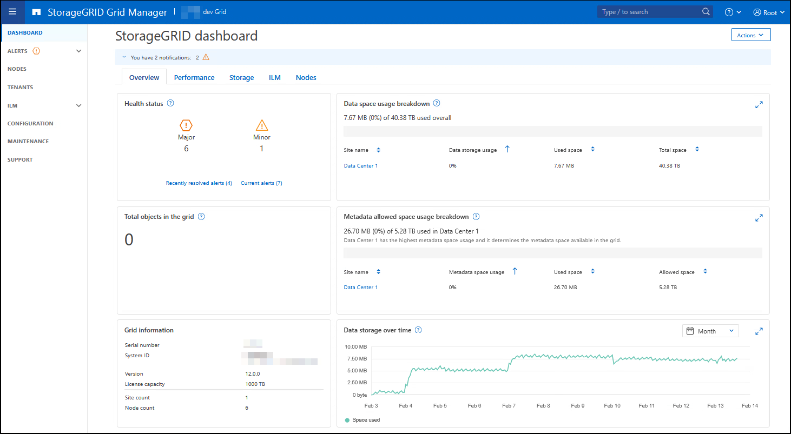

= Explore o Gerenciador de Grade
:allow-uri-read: 
:icons: font
:imagesdir: ../media/

[role="lead"]
O Gerenciador de Grade é a interface gráfica baseada em navegador que permite configurar, gerenciar e monitorar seu sistema StorageGRID.

NOTE: O Gerenciador de Grade é atualizado com cada versão e pode não corresponder às capturas de tela de exemplo nesta página.

Quando você entra no Gerenciador de Grade, você está se conetando a um nó Admin. Cada sistema StorageGRID inclui um nó de administração principal e qualquer número de nós de administração não primários. Você pode se conetar a qualquer nó de administrador e cada nó de administrador exibe uma exibição semelhante do sistema StorageGRID.

Você pode acessar o Gerenciador de Grade usando um link:../admin/web-browser-requirements.html["navegador da web suportado"].

== Painel do Grid Manager

Ao iniciar sessão pela primeira vez no Gestor de grelha, pode utilizar o painel para link:../monitor/viewing-dashboard.html["monitorar as atividades do sistema"] o visualizar rapidamente.

O dashboard contém informações sobre a integridade e a performance do sistema, o uso do storage, os processos de ILM, as operações S3 e os nós na grade. link:../monitor/viewing-dashboard.html["configure o painel de instrumentos"]Pode selecionar a partir de uma coleção de cartões que contêm as informações de que necessita para monitorizar eficazmente o seu sistema.

Para obter uma explicação das informações apresentadas em cada cartão, selecione o ícone de ajuda image:../media/icon_nms_question.png["ícone de ponto de interrogação"]para esse cartão.

== Campo de pesquisa

O campo *Search* na barra de cabeçalho permite que você navegue rapidamente para uma página específica dentro do Gerenciador de Grade. Por exemplo, você pode inserir *km* para acessar a página servidor de gerenciamento de chaves (KMS).

Você pode usar *Search* para encontrar entradas na barra lateral do Gerenciador de Grade e nos menus Configuração, Manutenção e suporte. Você também pode pesquisar por nome itens como nós de grade e contas de locatário.

== Menu Ajuda

O menu de ajuda image:../media/icon-help-menu-bar.png["ícone de ajuda na barra de menus"]fornece acesso a:

* O link:../fabricpool/use-fabricpool-setup-wizard.html["FabricPool"]assistente elink:../admin/use-s3-setup-wizard.html["Configuração S3"]
* O centro de documentação do StorageGRID para a versão atual
* link:../admin/using-grid-management-api.html["Documentação do API"]
* Informações sobre qual versão do StorageGRID está instalada atualmente

== Menu de alertas

O menu Alertas fornece uma interface fácil de usar para detetar, avaliar e resolver problemas que possam ocorrer durante a operação do StorageGRID.

No menu Alertas, você pode fazer o seguinte paralink:../monitor/managing-alerts.html["gerenciar alertas"]:

* Reveja os alertas atuais
* Reveja os alertas resolvidos
* Configure silêncios para suprimir notificações de alerta
* Defina regras de alerta para condições que acionam alertas
* Configure o servidor de e-mail para receber notificações de alerta

== Página de nós

O link:../monitor/viewing-nodes-page.html["Página de nós"] exibe informações sobre toda a grade, cada local na grade e cada nó em um local.

A home page dos nós exibe métricas combinadas para toda a grade. Para exibir informações de um site ou nó específico, selecione o site ou nó.

image::../media/nodes_page.png[página principal dos nós]

== Página de inquilinos

O link:../admin/managing-tenants.html["Página de inquilinos"] permite-lhe link:../tenant/index.html["crie e monitore as contas de locatários de storage"]utilizar o seu sistema StorageGRID. Você deve criar pelo menos uma conta de locatário para especificar quem pode armazenar e recuperar objetos e qual funcionalidade está disponível para eles.

A página locatários também fornece detalhes de uso para cada locatário, incluindo a quantidade de storage usada e o número de objetos. Se você definir uma cota quando criou o locatário, poderá ver quanto dessa cota foi usada.

image::../media/tenants_page.png[Menu e Página de inquilinos]

== Menu ILM

O link:using-information-lifecycle-management.html["Menu ILM"] permite que link:../ilm/index.html["Configurar as regras e políticas de gerenciamento do ciclo de vida das informações (ILM)"]você governe a durabilidade e a disponibilidade dos dados. Você também pode inserir um identificador de objeto para exibir os metadados desse objeto.

No menu ILM, você pode visualizar e gerenciar ILM:

* Regras
* Políticas
* Etiquetas de política
* Pools de armazenamento
* Classes de armazenamento
* Regiões
* Pesquisa de metadados de objetos

== Menu de configuração

O menu Configuração permite especificar as definições de rede, as definições de segurança, as definições do sistema, as opções de monitorização e as opções de controlo de acesso.

=== Tarefas de rede

As tarefas de rede incluem:

* link:../admin/managing-high-availability-groups.html["Gerenciamento de grupos de alta disponibilidade"]
* link:../admin/managing-load-balancing.html["Gerenciamento de pontos de extremidade do balanceador de carga"]
* link:../admin/configuring-s3-api-endpoint-domain-names.html["Configurando nomes de domínio de endpoint S3"]
* link:../admin/managing-traffic-classification-policies.html["Gerir políticas de classificação de tráfego"]
* link:../admin/configure-vlan-interfaces.html["Configurando interfaces VLAN"]

=== Tarefas de segurança

As tarefas de segurança incluem:

* link:../admin/using-storagegrid-security-certificates.html["Gerenciamento de certificados de segurança"]
* link:../admin/manage-firewall-controls.html["Gerenciamento de controles internos de firewall"]
* link:../admin/kms-configuring.html["Configurando servidores de gerenciamento de chaves"]
* Configurar as definições de segurança, incluindo link:../admin/manage-tls-ssh-policy.html["Política TLS e SSH"], link:../admin/changing-network-options-object-encryption.html["opções de segurança de rede e objetos"]e link:../admin/changing-browser-session-timeout-interface.html["definições de segurança da interface"].
* Configurar as definições de a link:../admin/configuring-storage-proxy-settings.html["proxy de storage"] ou A. link:../admin/configuring-admin-proxy-settings.html["proxy de administrador"]

=== Tarefas do sistema

As tarefas do sistema incluem:

* Uso link:../admin/grid-federation-overview.html["federação de grade"] para clonar informações da conta de locatário e replicar dados de objeto entre dois sistemas StorageGRID.
* Opcionalmente, ativando a link:../admin/configuring-stored-object-compression.html["Comprimir objetos armazenados"] opção.
* link:../ilm/managing-objects-with-s3-object-lock.html["Gerenciando o bloqueio de objetos S3"]
* Noções básicas sobre opções de armazenamento, link:../admin/what-object-segmentation-is.html["segmentação de objetos"]como e link:../admin/what-storage-volume-watermarks-are.html["marcas de água do volume de armazenamento"].
* link:../ilm/manage-erasure-coding-profiles.html["Gerenciar perfis de codificação de apagamento"].

=== Tarefas de monitorização

As tarefas de monitoramento incluem:

* link:../monitor/configure-audit-messages.html["Configurando mensagens de auditoria e destinos de log"]
* link:../monitor/using-snmp-monitoring.html["Utilizar a monitorização SNMP"]

=== Tarefas de controle de acesso

As tarefas de controle de acesso incluem:

* link:../admin/managing-admin-groups.html["Gerenciando grupos de administradores"]
* link:../admin/managing-users.html["Gerenciamento de usuários administrativos"]
* Alterar link:../admin/changing-provisioning-passphrase.html["frase-passe do aprovisionamento"]ou link:../admin/change-node-console-password.html["senhas do console do nó"]
* link:../admin/using-identity-federation.html["Usando a federação de identidade"]
* link:../admin/configuring-sso.html["Configurando SSO"]

== Menu de manutenção

O menu Manutenção permite executar tarefas de manutenção, manutenção do sistema e manutenção da rede.

=== Tarefas

As tarefas de manutenção incluem:

* link:../maintain/decommission-procedure.html["Operações de desativação"] para remover locais e nós de grade não utilizados
* link:../expand/index.html["Operações de expansão"] para adicionar novos nós de grade e locais
* link:../maintain/warnings-and-considerations-for-grid-node-recovery.html["Procedimentos de recuperação do nó de grade"] para substituir um nó com falha e restaurar dados
* link:../maintain/rename-grid-site-node-overview.html["Mudar o nome dos procedimentos"] para alterar os nomes de exibição de sua grade, sites e nós
* link:../troubleshoot/verifying-object-integrity.html["Operações de verificação de existência de objeto"] verificar a existência (embora não a correção) de dados de objeto
* Executando um link:../maintain/rolling-reboot-procedure.html["reinício contínuo"] para reiniciar vários nós de grade
* link:../maintain/restoring-volume.html["Operações de restauração de volume"]

=== Sistema

As tarefas de manutenção do sistema que você pode executar incluem:

* link:../admin/viewing-storagegrid-license-information.html["Visualizar informações de licença do StorageGRID"] ou link:../admin/updating-storagegrid-license-information.html["atualizando informações de licença"]
* Gerando e baixando o. link:../maintain/downloading-recovery-package.html["Pacote de recuperação"]
* Executar atualizações de software do StorageGRID, incluindo atualizações de software, hotfixes e atualizações do software SANtricity os em dispositivos selecionados
+
** link:../upgrade/index.html["Procedimento de atualização"]
** link:../maintain/storagegrid-hotfix-procedure.html["Procedimento de correção"]
** https://docs.netapp.com/us-en/storagegrid-appliances/sg6000/upgrading-santricity-os-on-storage-controllers-using-grid-manager-sg6000.html["Atualize o SANtricity os em controladores de storage SG6000 usando o Gerenciador de Grade"^]
** https://docs.netapp.com/us-en/storagegrid-appliances/sg5700/upgrading-santricity-os-on-storage-controllers-using-grid-manager-sg5700.html["Atualize o SANtricity os em controladores de storage SG5700 usando o Gerenciador de Grade"^]

=== Rede

As tarefas de manutenção de rede que você pode executar incluem:

* link:../maintain/configuring-dns-servers.html["Configurando servidores DNS"]
* link:../maintain/updating-subnets-for-grid-network.html["Atualizando sub-redes de rede de Grade"]
* link:../maintain/configuring-ntp-servers.html["Gerenciamento de servidores NTP"]

== Menu de suporte

O menu suporte fornece opções que ajudam o suporte técnico a analisar e solucionar problemas do seu sistema.

=== Ferramentas

Na seção Ferramentas do menu suporte, você pode:

* link:../admin/configure-autosupport-grid-manager.html["Configurar o AutoSupport"]
* link:../monitor/running-diagnostics.html["Execute o diagnóstico"] no estado atual da grelha
* link:../monitor/viewing-grid-topology-tree.html["Acesse a árvore de topologia de grade"] para exibir informações detalhadas sobre nós de grade, serviços e atributos
* link:../monitor/collecting-log-files-and-system-data.html["Colete arquivos de log e dados do sistema"]
* link:../monitor/reviewing-support-metrics.html["Analise as métricas de suporte"]
+

NOTE: As ferramentas disponíveis na opção *Metrics* destinam-se a ser utilizadas pelo suporte técnico. Alguns recursos e itens de menu dentro dessas ferramentas são intencionalmente não funcionais.

=== Alarmes (legado)

As informações sobre alarmes legados foram removidas desta versão da documentação. Consulte a https://docs.netapp.com/us-en/storagegrid-118/monitor/managing-alerts-and-alarms.html["Gerenciar alertas e alarmes (documentação do StorageGRID 11,8)"^].

=== Outros

Na outra seção do menu suporte, você pode:

* Gerenciar link:../admin/manage-link-costs.html["custo da ligação"]
* link:../admin/viewing-notification-status-and-queues.html["Sistema de gerenciamento de rede (NMS)"]Ver entradas
* Gerenciar link:../admin/what-storage-volume-watermarks-are.html["marcas de água de armazenamento"]

