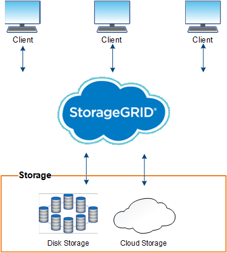

= O que é o StorageGRID?
:allow-uri-read: 
:icons: font
:imagesdir: ../media/

[role="lead"]
O NetApp StorageGRID é um pacote de storage de objetos definido por software compatível com uma ampla variedade de casos de uso em ambientes multicloud públicos, privados e híbridos. A StorageGRID oferece suporte nativo à API Amazon S3 e oferece inovações líderes do setor, como gerenciamento automatizado do ciclo de vida, para armazenar, proteger e preservar dados não estruturados de maneira econômica por longos períodos.

O StorageGRID fornece storage seguro e durável para dados não estruturados em escala. As políticas integradas de gerenciamento de ciclo de vida orientadas por metadados otimizam a localização dos dados durante todo o ciclo de vida. O conteúdo fica no local certo, no momento certo e na camada de storage certa para reduzir os custos.

O StorageGRID é composto por nós heterogêneos, redundantes e distribuídos geograficamente, que podem ser integrados a aplicativos clientes existentes e de próxima geração.

NOTE: O suporte para nós de arquivamento foi removido. Mover objetos de um nó de arquivo para um sistema de armazenamento de arquivamento externo por meio da API S3 foi substituído pelo link:../ilm/what-cloud-storage-pool-is.html["Pools de storage em nuvem da ILM"], que oferece mais funcionalidade.

== Benefícios do StorageGRID

As vantagens do sistema StorageGRID incluem o seguinte:

* Altamente escalável e fácil de usar um repositório de dados distribuído geograficamente para dados não estruturados.
* Protocolos padrão de storage de objetos:
+
** Amazon Web Services Simple Storage Service (S3)
** OpenStack Swift
+

NOTE: O suporte para aplicativos cliente Swift foi obsoleto e será removido em uma versão futura.

* Nuvem híbrida habilitada. O gerenciamento do ciclo de vida das informações (ILM) baseado em políticas armazena objetos em nuvens públicas, incluindo Amazon Web Services (AWS) e Microsoft Azure. Os serviços de plataforma StorageGRID permitem replicação de conteúdo, notificação de eventos e pesquisa de metadados de objetos armazenados em nuvens públicas.
* Proteção de dados flexível para garantir durabilidade e disponibilidade. Os dados podem ser protegidos usando replicação e codificação de apagamento em camadas. A verificação de dados em repouso e em trânsito garante a integridade para retenção a longo prazo.
* Gerenciamento dinâmico do ciclo de vida dos dados para ajudar a gerenciar custos de storage. Você pode criar regras de ILM que gerenciam o ciclo de vida dos dados no nível do objeto, personalizando a localidade, a durabilidade, o desempenho, o custo e o tempo de retenção dos dados.
* Alta disponibilidade de storage de dados e algumas funções de gerenciamento, com balanceamento de carga integrado para otimizar a carga de dados entre os recursos da StorageGRID.
* Suporte para várias contas de inquilinos de storage para segregar os objetos armazenados em seu sistema por diferentes entidades.
* Várias ferramentas para monitorar a integridade do seu sistema StorageGRID, incluindo um sistema de alerta abrangente, um painel gráfico e status detalhado para todos os nós e sites.
* Suporte para implantação baseada em software ou hardware. Você pode implantar o StorageGRID em qualquer uma das seguintes opções:
+
** Máquinas virtuais em execução no VMware.
** Motores de contentor em hosts Linux.
** Aparelhos projetados pela StorageGRID.
+
*** Os dispositivos de storage fornecem storage de objetos.
*** Os dispositivos de serviços fornecem serviços de administração de grade e balanceamento de carga.

* Em conformidade com os requisitos de armazenamento relevantes destes regulamentos:
+
** Securities and Exchange Commission (SEC) em 17 CFR 240,17a-4(f), que regula os membros de câmbio, corretores ou revendedores.
** Regra 4511(c) da Financial Industry Regulatory Authority (FINRA), que defensa o formato e os requisitos de Mídia da regra 17a-4(f) da SEC.
** Comissão de negociação de futuros de commodities (CFTC) na regra 17 CFR 1,31 (c)-(d), que regula a negociação de futuros de commodities.

* Operações de atualização e manutenção sem interrupções. Mantenha o acesso ao conteúdo durante os procedimentos de atualização, expansão, desativação e manutenção.
* Gerenciamento de identidade federado. Integra-se com ative Directory, OpenLDAP ou Oracle Directory Service para autenticação de usuário. Suporta logon único (SSO) usando o padrão SAML 2,0 (Security Assertion Markup Language 2,0) para trocar dados de autenticação e autorização entre o StorageGRID e o AD FS (Serviços de Federação do ative Directory).

