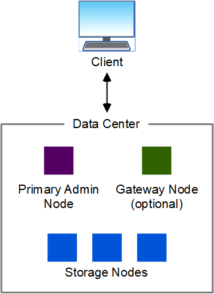

= Topologia de rede e arquitetura StorageGRID
:allow-uri-read: 
:icons: font
:imagesdir: ../media/

[role="lead"]
Um sistema StorageGRID consiste em vários tipos de nós de grade em um ou mais locais de data center.

Consulte link:nodes-and-services.html["descrições dos tipos de nó de grade"].

Para obter informações adicionais sobre topologia de rede, requisitos e comunicações em grade do StorageGRID, consulte o link:../network/index.html["Diretrizes de rede"].

== Topologias de implantação

O sistema StorageGRID pode ser implantado em um único local de data center ou em vários locais de data center.

=== Um único local

Em uma implantação com um único local, a infraestrutura e as operações do sistema StorageGRID são centralizadas.

=== Vários locais

Em uma implantação com vários sites, diferentes tipos e números de recursos do StorageGRID podem ser instalados em cada local. Por exemplo, pode ser necessário mais armazenamento em um data center do que em outro.

Diferentes locais são frequentemente localizados em locais geograficamente diferentes em diferentes domínios de falha, como uma linha de falha de Terremoto ou planície de inundação. O compartilhamento de dados e a recuperação de desastres são obtidos pela distribuição automatizada de dados para outros sites.

image::../media/data_center_sites_multiple.png[Vários locais de data center]

Vários locais lógicos também podem existir em um único data center para permitir o uso de replicação distribuída e codificação de apagamento para aumentar a disponibilidade e a resiliência.

=== Redundância de nó de grade

Em uma implantação de um único local ou de vários locais, você pode incluir opcionalmente mais de um nó de administrador ou nó de gateway para redundância. Por exemplo, você pode instalar mais de um nó de administrador em um único site ou em vários sites. No entanto, cada sistema StorageGRID só pode ter um nó de administração principal.

== Arquitetura do sistema

Este diagrama mostra como os nós de grade são organizados dentro de um sistema StorageGRID.

image::../media/grid_nodes_and_components.png[diagrama descrito pelo texto circundante]

Os clientes S3 armazenam e recuperam objetos no StorageGRID. Outros clientes são usados para enviar notificações por e-mail, acessar a interface de gerenciamento do StorageGRID e, opcionalmente, acessar o compartilhamento de auditoria.

Os clientes S3 podem se conetar a um nó de gateway ou a um nó de administrador para usar a interface de balanceamento de carga aos nós de storage. Como alternativa, os clientes S3 podem se conectar diretamente aos nós de storage usando HTTPS.

Os objetos podem ser armazenados no StorageGRID em nós de storage baseados em software ou hardware ou em pools de storage de nuvem, que consistem em buckets externos do S3 ou contêineres de storage Azure Blob.
