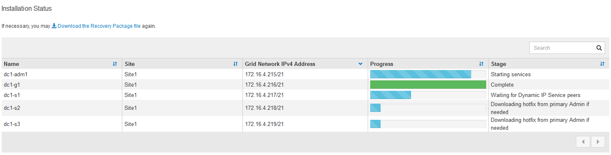

= Revise sua configuração e conclua a instalação
:allow-uri-read: 
:icons: font
:imagesdir: ../media/

[role="lead"]
Você deve analisar cuidadosamente as informações de configuração inseridas para garantir que a instalação seja concluída com êxito.

.Passos
. Veja a página *Summary*.
+
image::../media/11_gmi_installer_summary_page.gif[Esta imagem é explicada pelo texto circundante.]

. Verifique se todas as informações de configuração da grade estão corretas. Use os links Modificar na página Resumo para voltar e corrigir quaisquer erros.
. Clique em *Instalar*.
+

NOTE: Se um nó estiver configurado para usar a rede do cliente, o gateway padrão para esse nó alterna da rede da grade para a rede do cliente quando você clica em *Instalar*. Se você perder a conetividade, deve garantir que está acessando o nó de administração principal por meio de uma sub-rede acessível. link:../network/index.html["Diretrizes de rede"]Consulte para obter detalhes.

. Clique em *Download Recovery Package*.
+
Quando a instalação progride até o ponto em que a topologia da grade é definida, você será solicitado a baixar o arquivo do Pacote de recuperação (`.zip`) e confirmar que você pode acessar com êxito o conteúdo desse arquivo. Você deve baixar o arquivo do pacote de recuperação para que você possa recuperar o sistema StorageGRID se um ou mais nós de grade falharem. A instalação continua em segundo plano, mas você não pode concluir a instalação e acessar o sistema StorageGRID até baixar e verificar esse arquivo.

. Verifique se você pode extrair o conteúdo do `.zip` arquivo e salvá-lo em dois locais seguros, seguros e separados.
+

CAUTION: O arquivo do pacote de recuperação deve ser protegido porque contém chaves de criptografia e senhas que podem ser usadas para obter dados do sistema StorageGRID.

. Marque a caixa de seleção *Eu baixei e verifiquei com êxito o arquivo do pacote de recuperação* e clique em *Avançar*.
+
Se a instalação ainda estiver em andamento, a página de status será exibida. Esta página indica o progresso da instalação para cada nó de grade.

+

+
Quando o estágio completo é alcançado para todos os nós de grade, a página de login do Gerenciador de Grade é exibida.

. Inicie sessão no Grid Manager utilizando o utilizador "root" e a palavra-passe especificada durante a instalação.

