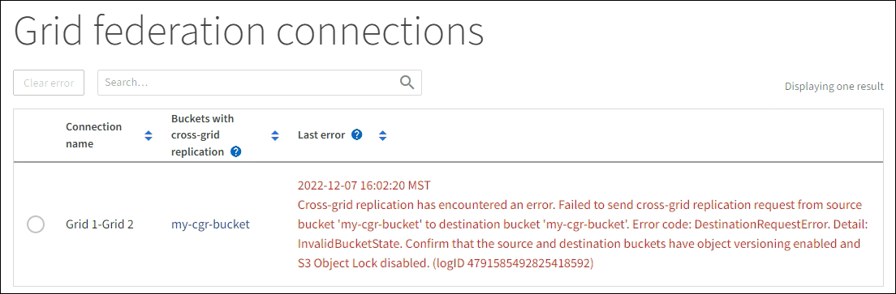

= Exibir conexões de federação de grade
:allow-uri-read: 
:icons: font
:imagesdir: ../media/

[role="lead"]
Se sua conta de locatário tiver a permissão *usar conexão de federação de grade*, você poderá visualizar as conexões permitidas.

.Antes de começar
* A conta de locatário tem a permissão *Use Grid Federation Connection*.
* Você está conetado ao Gerenciador do Locatário usando um link:../admin/web-browser-requirements.html["navegador da web suportado"].
* Você pertence a um grupo de usuários que tem o link:tenant-management-permissions.html["Permissão de acesso à raiz"].

.Passos
. Selecione *STORAGE (S3)* > *conexões de federação de grade*.
+
A página de conexão de federação de grade é exibida e inclui uma tabela que resume as seguintes informações:

+
[cols="1a,2a"]
|===
| Coluna | Descrição 

 a| 
Nome da ligação
 a| 
As conexões de federação de grade que este locatário tem permissão para usar.

 a| 
Buckets com replicação entre grade
 a| 
Para cada conexão de federação de grade, os buckets do locatário que têm replicação entre grade habilitada. Os objetos adicionados a esses buckets serão replicados para a outra grade na conexão.

 a| 
Último erro
 a| 
Para cada conexão de federação de grade, o erro mais recente ocorre, se houver, quando os dados estavam sendo replicados para a outra grade. <<clear-last-error,Apague o último erro>>Consulte .

|===
. Opcionalmente, selecione um nome de bucket para link:viewing-s3-bucket-details.html["veja os detalhes do balde"].

== [[clear-last-error]]limpe o último erro

Um erro pode aparecer na coluna *último erro* por um destes motivos:

* A versão do objeto fonte não foi encontrada.
* O balde de origem não foi encontrado.
* O intervalo de destino foi eliminado.
* O intervalo de destino foi recriado por uma conta diferente.
* O bucket de destino tem controle de versão suspenso.
* O intervalo de destino foi recriado pela mesma conta, mas agora não foi versionado.

NOTE: Esta coluna mostra apenas o último erro de replicação entre grelha a ocorrer; os erros anteriores que possam ter ocorrido não serão apresentados.

.Passos
. Se uma mensagem for exibida na coluna *último erro*, exiba o texto da mensagem.
+
Por exemplo, esse erro indica que o intervalo de destino para replicação entre grades estava em um estado inválido, possivelmente porque o controle de versão foi suspenso ou o bloqueio de objeto S3 foi ativado.

+

. Execute quaisquer ações recomendadas. Por exemplo, se o controle de versão foi suspenso no bucket de destino para replicação entre grades, reative o controle de versão desse bucket.
. Selecione a ligação na tabela.
. Selecione *Clear error*.
. Selecione *Sim* para limpar a mensagem e atualizar o estado do sistema.
. Aguarde 5-6 minutos e, em seguida, insira um novo objeto no balde. Confirme se a mensagem de erro não reaparece.
+

NOTE: Para garantir que a mensagem de erro seja limpa, aguarde pelo menos 5 minutos após o carimbo de data/hora na mensagem antes de inserir um novo objeto.

. Para determinar se algum objeto não pôde ser replicado devido ao erro de bucket, link:../admin/grid-federation-retry-failed-replication.html["Identificar e tentar novamente operações de replicação com falha"]consulte .

