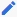

= Gerenciar usuários locais
:allow-uri-read: 
:icons: font
:imagesdir: ../media/

[role="lead"]
Você pode criar usuários locais e atribuí-los a grupos locais para determinar quais recursos esses usuários podem acessar. O Gerenciador do Tenant inclui um usuário local predefinido, chamado "root". Embora você possa adicionar e remover usuários locais, você não pode remover o usuário raiz.

NOTE: Se o logon único (SSO) estiver habilitado para o sistema StorageGRID, os usuários locais não poderão fazer login no Gerenciador do Locatário ou na API de Gerenciamento do Locatário, embora possam usar aplicativos cliente para acessar os recursos do locatário, com base nas permissões de grupo.

.Antes de começar
* Você está conetado ao Gerenciador do Locatário usando um link:../admin/web-browser-requirements.html["navegador da web suportado"].
* Você pertence a um grupo de usuários que tem o link:tenant-management-permissions.html["Permissão de acesso à raiz"].
* Se sua conta de locatário tiver a permissão *usar conexão de federação de grade*, você revisou o fluxo de trabalho e as considerações para link:grid-federation-account-clone.html["clonar grupos de locatários e usuários"], e você estará conetado à grade de origem do locatário.

== [[create-user]]Crie um usuário local

Você pode criar um usuário local e atribuí-lo a um ou mais grupos locais para controlar suas permissões de acesso.

S3 os usuários que não pertencem a nenhum grupo não têm permissões de gerenciamento ou políticas de grupo S3 aplicadas a eles. Esses usuários podem ter acesso ao bucket do S3 concedido por meio de uma política de bucket.

Os usuários Swift que não pertencem a nenhum grupo não têm permissões de gerenciamento ou acesso ao contentor Swift.

=== Acesse o assistente criar usuário

.Passos
. Selecione *GERENCIAMENTO DE ACESSO* > *usuários*.
+
Se sua conta de locatário tiver a permissão *usar conexão de federação de grade*, um banner azul indica que essa é a grade de origem do locatário. Todos os usuários locais que você criar nesta grade serão clonados para a outra grade na conexão.

+
image::../media/grid-federation-tenant-user-banner.png[Imagem do banner azul na página do usuário se esta for a grade de origem do locatário]

. Selecione *criar usuário*.

=== Introduza as credenciais

.Passos
. Para a etapa *Insira as credenciais do usuário*, preencha os campos a seguir.
+
[cols="1a,3a"]
|===
| Campo | Descrição 

 a| 
Nome completo
 a| 
O nome completo deste usuário, por exemplo, o nome e sobrenome de uma pessoa ou o nome de um aplicativo.

 a| 
Nome de utilizador
 a| 
O nome que este usuário usará para entrar. Os nomes de usuário devem ser exclusivos e não podem ser alterados.

*Nota*: Se a sua conta de locatário tiver a permissão *Use Grid Federation Connection*, ocorrerá um erro de clonagem se o mesmo *Username* já existir para o locatário na grade de destino.

 a| 
Senha e confirmar senha
 a| 
A senha que o usuário usará inicialmente ao fazer login.

 a| 
Negar acesso
 a| 
Selecione *Sim* para impedir que esse usuário faça login na conta de locatário, mesmo que ele ainda possa pertencer a um ou mais grupos.

Por exemplo, selecione *Sim* para suspender temporariamente a capacidade de um usuário fazer login.

|===
. Selecione *continuar*.

=== Atribuir a grupos

.Passos
. Atribua o usuário a um ou mais grupos locais para determinar quais tarefas podem ser executadas.
+
Atribuir um usuário a grupos é opcional. Se preferir, você pode selecionar usuários ao criar ou editar grupos.

+
Os usuários que não pertencem a nenhum grupo não terão permissões de gerenciamento. As permissões são cumulativas. Os usuários terão todas as permissões para todos os grupos aos quais pertencem. link:tenant-management-permissions.html["Permissões de gerenciamento do locatário"]Consulte .

. Selecione *criar usuário*.
+
Se sua conta de locatário tiver a permissão *Use Grid Federation Connection* e você estiver na grade de origem do locatário, o novo usuário local será clonado para a grade de destino do locatário. *Success* aparece como *status de clonagem* na seção Visão geral da página de detalhes do usuário.

. Selecione *Finish* para retornar à página usuários.

== Ver ou editar utilizador local

.Passos
. Selecione *GERENCIAMENTO DE ACESSO* > *usuários*.
. Revise as informações fornecidas na página usuários, que lista informações básicas para todos os usuários locais e federados dessa conta de locatário.
+
Se a conta de locatário tiver a permissão *usar conexão de federação de grade* e você estiver visualizando o usuário na grade de origem do locatário:

+
** Uma mensagem de banner indica que, se você editar ou remover um usuário, suas alterações não serão sincronizadas com a outra grade.
** Conforme necessário, uma mensagem de banner indica se os usuários não foram clonados para o locatário na grade de destino. Você pode <<clone-users,tente novamente um clone de usuário que falhou>>.

. Se pretender alterar o nome completo do utilizador:
+
.. Selecione a caixa de verificação para o utilizador.
.. Selecione *ações* > *Editar nome completo*.
.. Introduza o novo nome.
.. Selecione *Salvar alterações.*

. Se você quiser ver mais detalhes ou fazer edições adicionais, faça um dos seguintes procedimentos:
+
** Selecione o nome de utilizador.
** Marque a caixa de seleção para o usuário e selecione *ações* > *Exibir detalhes do usuário*.

. Revise a seção Visão geral, que mostra as seguintes informações para cada usuário:
+
** Nome completo
** Nome de utilizador
** Tipo de utilizador
** Acesso negado
** Modo de acesso
** Associação ao grupo
** Campos adicionais se a conta de locatário tiver a permissão *usar conexão de federação de grade* e você estiver visualizando o usuário na grade de origem do locatário:
+
*** Status da clonagem, *sucesso* ou *falha*
*** Um banner azul indicando que, se você editar este usuário, suas alterações não serão sincronizadas com a outra grade.

. Edite as definições do utilizador conforme necessário. Consulte <<create-user,Criar utilizador local>> para obter detalhes sobre o que introduzir.
+
.. Na seção Visão geral , altere o nome completo selecionando o nome ou o ícone de edição .
+
Você não pode alterar o nome de usuário.

.. Na guia *Senha*, altere a senha do usuário e selecione *Salvar alterações*.
.. Na guia *Access*, selecione *não* para permitir que o usuário faça login ou selecione *Sim* para impedir que o usuário faça login. Em seguida, selecione *Salvar alterações*.
.. Na guia *teclas de acesso*, selecione *criar chave* e siga as instruções para link:creating-another-users-s3-access-keys.html["Criando as chaves de acesso S3 de outro usuário"].
.. Na guia *grupos*, selecione *Editar grupos* para adicionar o usuário aos grupos ou remover o usuário dos grupos. Em seguida, selecione *Salvar alterações*.

. Confirme se selecionou *Guardar alterações* para cada secção alterada.

== Duplicar utilizador local

Você pode duplicar um usuário local para criar um novo usuário mais rapidamente.

NOTE: Se sua conta de locatário tiver a permissão *usar conexão de federação de grade* e você duplicar um usuário da grade de origem do locatário, o usuário duplicado será clonado para a grade de destino do locatário.

.Passos
. Selecione *GERENCIAMENTO DE ACESSO* > *usuários*.
. Selecione a caixa de verificação para o utilizador que pretende duplicar.
. Selecione *ações* > *usuário duplicado*.
. Consulte <<create-user,Criar utilizador local>> para obter detalhes sobre o que introduzir.
. Selecione *criar usuário*.

== [[clone-users]]Repetir o clone do usuário

Para tentar novamente um clone que falhou:

. Selecione cada usuário que indica _(Falha na clonagem)_ abaixo do nome de usuário.
. Selecione *ações* > *Clone usuários*.
. Veja o status da operação de clone na página de detalhes de cada usuário que você está clonando.

Para obter informações adicionais, link:grid-federation-account-clone.html["Clonar grupos de locatários e usuários"]consulte .

== Exclua um ou mais usuários locais

Você pode excluir permanentemente um ou mais usuários locais que não precisam mais acessar a conta de locatário do StorageGRID.

NOTE: Se sua conta de locatário tiver a permissão *usar conexão de federação de grade* e você excluir um usuário local, o StorageGRID não excluirá o usuário correspondente na outra grade. Se você precisar manter essas informações em sincronia, você deve excluir o mesmo usuário de ambas as grades.

NOTE: Você deve usar a origem de identidade federada para excluir usuários federados.

.Passos
. Selecione *GERENCIAMENTO DE ACESSO* > *usuários*.
. Selecione a caixa de verificação para cada utilizador que pretende eliminar.
. Selecione *ações* > *Excluir usuário* ou *ações* > *Excluir usuários*.
+
É apresentada uma caixa de diálogo de confirmação.

. Selecione *Excluir usuário* ou *Excluir usuários*.

